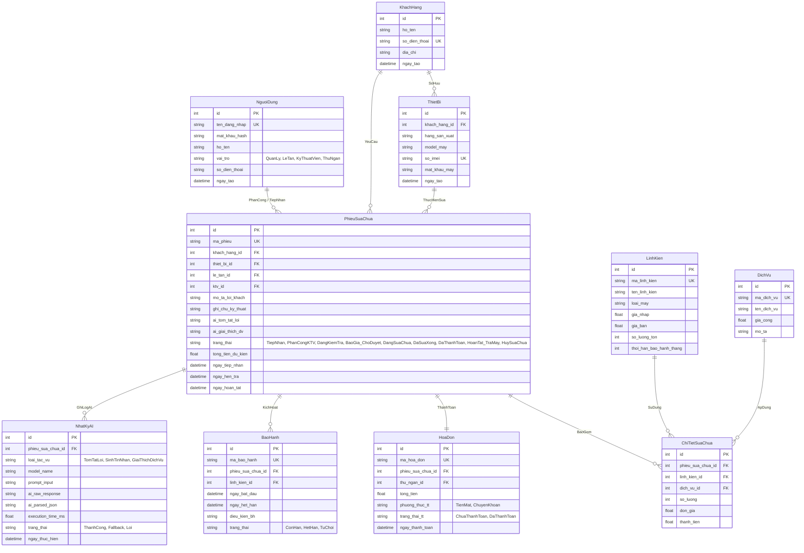
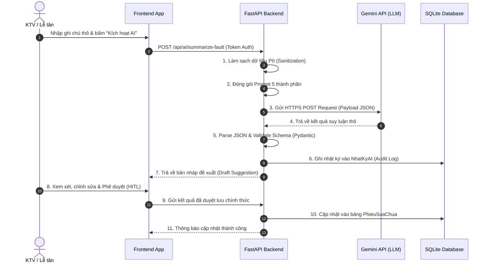

# BÁO CÁO PHÂN TÍCH VÀ THIẾT KẾ HỆ THỐNG
## ĐỀ TÀI: HỆ THỐNG QUẢN LÝ TRUNG TÂM SỬA CHỮA ĐIỆN THOẠI TÍCH HỢP AI (PHONECARE AI)
### BÀI KIỂM TRA THƯỜNG XUYÊN 1 (KT1) - ĐÁP ỨNG TOÀN DIỆN 10 TIÊU CHÍ ĐÁNH GIÁ

---

## 📑 MỤC LỤC BÁO CÁO (TABLE OF CONTENTS)
1. **[TIÊU CHÍ 1: Phân Tích Đúng Bài Toán Quản Lý](#1-tiêu-chí-1-phân-tích-bài-toán-quản-lý)**
   - 1.1. Bối cảnh hoạt động & Quy mô trung tâm
   - 1.2. 5 Tác nhân và Công việc hàng ngày (Daily Responsibilities)
   - 1.3. Các nhóm dữ liệu nghiệp vụ cốt lõi
   - 1.4. Quy trình nghiệp vụ hiện tại (As-Is Process)
   - 1.5. Các vấn đề tồn tại (Pain Points) và Giải pháp hệ thống tương lai (To-Be)
2. **[TIÊU CHÍ 2: Xác Định Đầy Đủ Yêu Cầu Chức Năng (FR-01 đến FR-12)](#2-tiêu-chí-2-xác-định-đầy-đủ-yêu-cầu-chức-năng-functional-requirements---fr)**
3. **[TIÊU CHÍ 3: Xác Định Yêu Cầu Phi Chức Năng (Bảng NFR 7 Cột - 6 Nhóm Bắt Buộc)](#3-tiêu-chí-3-xác-định-yêu-cầu-phi-chức-năng-non-functional-requirements---nfr)**
4. **[TIÊU CHÍ 4: Thiết Kế Tác Nhân (Actors) Và Ca Sử Dụng (Use Case)](#4-tiêu-chí-4-thiết-kế-tác-nhân-actors-và-ca-sử-dụng-use-case)**
   - 4.1. Sơ đồ Use Case tổng quát (Mermaid) & Ma trận RBAC
   - 4.2. Đặc tả chi tiết 5 Ca sử dụng trọng tâm
5. **[TIÊU CHÍ 5: Thiết Kế Cơ Sở Dữ Liệu (ERD & Data Dictionary 10 Bảng)](#5-tiêu-chí-5-thiết-kế-cơ-sở-dữ-liệu-database-design)**
6. **[TIÊU CHÍ 6: Thiết Kế Kiến Trúc Hệ Thống (Multi-Tier & Data Flow)](#6-tiêu-chí-6-thiết-kế-kiến-trúc-hệ-thống-system-architecture)**
7. **[TIÊU CHÍ 7: Xác Định 3 Vị Trí Ứng Dụng AI Trong Quy Trình Nghiệp Vụ](#7-tiêu-chí-7-xác-định-vị-trí-ứng-dụng-ai-trong-quy-trình-nghiệp-vụ)**
8. **[TIÊU CHÍ 8: Thiết Kế Prompt 5 Thành Phần & Luồng Gọi AI](#8-tiêu-chí-8-thiết-kế-prompt-và-luồng-gọi-ai-sơ-bộ)**
9. **[TIÊU CHÍ 9: Minh Chứng Sử Dụng AI Trong Phân Tích Và Thiết Kế (AI Evidence Log)](#9-tiêu-chí-9-minh-chứng-sử-dụng-ai-trong-phân-tích-và-thiết-kế-ai-usage-log---kt1)**
10. **[TIÊU CHÍ 10: Tài Liệu Phân Tích Thiết Kế & Kế Hoạch Triển Khai KT2, KT3, Cuối Kỳ](#10-tiêu-chí-10-tài-liệu-phân-tích-thiết-kế-và-kế-hoạch-triển-khai-các-giai-đoạn-tiếp-theo)**

---

## 📖 BẢNG GIẢI THÍCH THUẬT NGỮ VÀ TỪ VIẾT TẮT (GLOSSARY)

| Thuật ngữ / Viết tắt | Tên tiếng Anh đầy đủ | Giải thích ý nghĩa trong dự án PhoneCare AI |
|---|---|---|
| **AI-Augmented SDLC** | AI-Augmented Software Development Life Cycle | Quy trình phát triển phần mềm có trí tuệ nhân tạo đồng hành hỗ trợ phân tích, thiết kế, sinh code và kiểm thử. |
| **RBAC** | Role-Based Access Control | Mô hình kiểm soát truy cập phân quyền dựa trên 4 vai trò: `QuanLy`, `LeTan`, `KyThuatVien`, `ThuNgan`. |
| **JWT** | JSON Web Tokens | Chuẩn mã hóa token (HS256) dùng để xác thực các yêu cầu API an toàn giữa Frontend và Backend. |
| **PII** | Personally Identifiable Information | Thông tin định danh cá nhân (SĐT, IMEI, Họ tên, Địa chỉ) được module `DataSanitizer` bảo vệ trước khi gửi đến AI. |
| **HITL** | Human-in-the-Loop | Cơ chế con người (KTV/Lễ tân) luôn kiểm tra, chỉnh sửa và bấm nút phê duyệt kết quả AI trước khi lưu vào CSDL. |
| **FR** | Functional Requirement | Yêu cầu chức năng của hệ thống (mô tả hệ thống làm được những gì). |
| **NFR** | Non-Functional Requirement | Yêu cầu phi chức năng (mô tả chất lượng: bảo mật, hiệu năng, khả dụng, sao lưu, UX). |
| **ERD** | Entity Relationship Diagram | Sơ đồ quan hệ giữa các thực thể dữ liệu trong cơ sở dữ liệu. |
| **KTV** | Kỹ Thuật Viên (Technician) | Nhân viên chịu trách nhiệm kiểm tra phần cứng, sửa chữa thiết bị và nhập ghi chú kỹ thuật. |
| **CRUD** | Create, Read, Update, Delete | 4 thao tác cơ bản trên dữ liệu: Tạo mới, Đọc/Tra cứu, Cập nhật và Xóa. |

---

## 1. TIÊU CHÍ 1: PHÂN TÍCH BÀI TOÁN QUẢN LÝ

### 1.1. Bối cảnh hoạt động & Quy mô trung tâm
Trong bối cảnh bùng nổ thiết bị di động thông minh, nhu cầu bảo dưỡng, sửa chữa và thay thế linh kiện tại các trung tâm dịch vụ kỹ thuật tăng trưởng đột biến. Dự án **PhoneCare AI** được thiết kế dựa trên khảo sát thực tế tại trung tâm dịch vụ sửa chữa thiết bị di động quy mô vừa:
* **Quy mô nhân sự**: Trung tâm hoạt động với đội ngũ **8 - 12 nhân sự**, bao gồm:
  - 01 Quản lý trung tâm (Giám đốc kỹ thuật / Quản trị viên).
  - 02 Nhân viên Lễ tân kiêm Chăm sóc khách hàng.
  - 04 - 06 Kỹ thuật viên phần cứng và phần mềm.
  - 01 Nhân viên Thu ngân / Kế toán kho.
* **Quy mô xử lý nghiệp vụ**: Trung tâm tiếp nhận trung bình từ **30 - 80 thiết bị/ngày** với hàng chục chủng loại lỗi đa dạng (mất nguồn, vỡ màn hình AMOLED, chai phù pin, lỗi IC sóng, chập đường nguồn VDD_MAIN, hỏng bo sạc Type-C, máy vào nước,...).

### 1.2. 5 Tác nhân và Công việc hàng ngày (Daily Responsibilities)
1. **Quản lý trung tâm (`QuanLy` / Admin)**:
   - *Đầu ca*: Phân công lượng phiếu tồn đọng cho các KTV theo chuyên môn (chuyên màn hình, chuyên sửa mainboard/ép kính).
   - *Trong ca*: Giám sát tiến độ sửa chữa, điều chỉnh tồn kho linh kiện, duyệt các báo giá vượt hạn mức, tra cứu Audit Log gọi AI.
   - *Cuối ca*: Xem biểu đồ doanh thu, báo cáo năng suất lao động và tỷ lệ bảo hành lại của từng KTV.
2. **Lễ tân / Tiếp nhận (`LeTan` / Receptionist)**:
   - *Hàng ngày*: Trực tiếp chào đón khách hàng, ghi nhận hiện trạng lỗi, chụp ảnh ngoại quan thiết bị (lưu vết vết trầy xước/nứt vỡ tránh tranh chấp).
   - *Tác nghiệp*: Lập phiếu tiếp nhận, sử dụng trợ lý AI tạo tin nhắn SMS/Zalo cập nhật tiến độ cho khách, gọi điện thoại thông báo nhận máy và bàn giao thiết bị.
3. **Kỹ thuật viên (`KyThuatVien` / Technician)**:
   - *Hàng ngày*: Nhận thiết bị được phân công trên dashboard, tháo máy đo đạc kiểm tra phần cứng.
   - *Tác nghiệp*: Nhập ghi chú kỹ thuật thô, kích hoạt **AI Vị trí 1** để phân tích lỗi và đề xuất linh kiện nghi ngờ; gán linh kiện xuất kho, thực hiện thay thế/sửa chữa và cập nhật trạng thái sang `DaSuaXong`.
4. **Thu ngân (`ThuNgan` / Cashier)**:
   - *Hàng ngày*: Tiếp nhận phiếu đã sửa xong, kiểm tra chi tiết bảng tính tiền (Tiền linh kiện + Tiền công dịch vụ).
   - *Tác nghiệp*: Xuất hóa đơn thanh toán, thu tiền (Tiền mặt hoặc Chuyển khoản QR), xác nhận thanh toán `DaThanhToan` và in phiếu bảo hành điện tử.
5. **Khách hàng (`KhachHang` / Customer - Tác nhân bên ngoài)**:
   - *Hàng ngày*: Mang thiết bị đến trung tâm, cung cấp thông tin liên hệ và mô tả lỗi gặp phải.
   - *Tác nghiệp*: Nhận tin nhắn thông báo tiến độ tự động (SMS/Zalo do AI sinh), tra cứu tình trạng máy trực tuyến qua mã phiếu, đọc giải thích nguyên nhân lỗi bằng ngôn ngữ đời thường và xác nhận sửa chữa.

### 1.3. Các nhóm dữ liệu nghiệp vụ cốt lõi cần quản lý
Hệ thống quản trị tập trung 6 nhóm thực thể dữ liệu:
1. **Dữ liệu Khách hàng & Thiết bị**: Họ tên, Số điện thoại (duy nhất), Địa chỉ, Hãng sản xuất (Apple, Samsung, Xiaomi,...), Model máy, Số IMEI/Serial, Mật khẩu khóa máy, **Ảnh chụp hiện trạng thiết bị khi tiếp nhận**.
2. **Dữ liệu Phiếu sửa chữa**: Mã phiếu định danh duy nhất (`PSC-YYYYMMDD-XXX`), ngày giờ tiếp nhận, ngày hẹn trả, mô tả lỗi khách báo, ghi chú kỹ thuật KTV, trạng thái vòng đời.
3. **Dữ liệu Danh mục Kho & Dịch vụ**: Mã linh kiện, tên linh kiện, giá nhập, giá bán, số lượng tồn kho, mức tồn tối thiểu cảnh báo; Mã dịch vụ, tên công thợ kỹ thuật, đơn giá tiền công.
4. **Dữ liệu Chi tiết sửa chữa**: Bảng liên kết đa-đa giữa Phiếu sửa chữa với Linh kiện và Dịch vụ, số lượng, đơn giá và thành tiền tại thời điểm sửa.
5. **Dữ liệu Hóa đơn & Bảo hành điện tử**: Mã hóa đơn, tổng tiền, phương thức thanh toán, thời gian thanh toán, mã bảo hành, ngày hết hạn bảo hành độc lập cho từng linh kiện.
6. **Dữ liệu Nhật ký Hoạt động AI (AI Audit Log)**: Loại tác vụ (`TomTatLoi`, `SinhTinNhan`, `GiaiThichDichVu`), model AI sử dụng, prompt đầu vào (đã làm sạch PII), kết quả raw AI trả về, thời gian phản hồi (ms), trạng thái thành công hoặc Fallback.

### 1.4. Quy trình nghiệp vụ hiện tại (As-Is Process)
Trước khi tin học hóa, trung tâm vận hành theo quy trình truyền thống với nhiều bước thủ công:
```
[Khách mang máy đến] --> [Lễ tân viết Phiếu giấy Carbon 2 liên] --> [Chuyển máy vào khay KTV]
                                                                          |
[Giao máy & Thu tiền] <-- [Lễ tân gọi điện báo giá] <-- [KTV tháo máy & ghi sổ tay kỹ thuật]
```
* **Bước 1**: Lễ tân viết tay phiếu tiếp nhận bằng giấy than 2 liên, giao 1 liên cho khách giữ.
* **Bước 2**: Máy được để vào rổ nhựa chuyển vào khu vực kỹ thuật. KTV tự lấy máy làm mà không có thứ tự ưu tiên rõ ràng.
* **Bước 3**: KTV kiểm tra xong, ghi vắn tắt vào sổ tay hoặc gọi miệng cho Lễ tân để Lễ tân gọi điện báo giá cho khách.
* **Bước 4**: Nếu khách đồng ý, KTV sang kho lấy linh kiện (ghi sổ kho thủ công) và tiến hành sửa chữa.
* **Bước 5**: Sửa xong, máy được chuyển ra quầy lễ tân; Lễ tân gọi điện thông báo khách đến nhận máy, thu tiền mặt và viết giấy bảo hành tay.

### 1.5. Các vấn đề tồn tại (Pain Points) và Giải pháp hệ thống To-Be (Tích hợp AI)

| Điểm nghẽn thực tế (Pain Points) | Hậu quả trong vận hành | Giải pháp Hệ thống PhoneCare AI (To-Be) |
|---|---|---|
| **1. Thất lạc phiếu giấy & Tranh chấp ngoại quan** | Phiếu giấy than dễ rách/mất; khách khiếu nại máy bị trầy xước thêm sau khi sửa mà không có bằng chứng đối soát. | Số hóa 100% hồ sơ điện tử; bắt buộc **chụp ảnh hiện trạng máy lưu CSDL** khi tiếp nhận; cấp mã QR tra cứu trực tuyến. |
| **2. Khách liên tục gọi hỏi tiến độ** | Lễ tân mất 30% thời gian trong ngày chỉ để nghe điện thoại hỏi "Máy tôi xong chưa?"; gây ức chế cho khách hàng. | Tích hợp **AI Vị trí 2 tự động sinh tin nhắn tiến độ SMS/Zalo** gửi ngay khi KTV đổi trạng thái phiếu. |
| **3. Ghi chú KTV viết tắt, khó hiểu** | KTV ghi: *"U2 sụt áp, chập VDD_MAIN, đứt chân socket 4"* khiến Lễ tân lúng túng khi giải thích, khách nghi ngờ trung tâm nâng khống bệnh. | **AI Vị trí 1 & 3** chuẩn hóa ghi chú KTV thành JSON và diễn giải bằng hình ảnh so sánh đời thường, minh bạch hóa tiền công và linh kiện. |
| **4. Sai sót tính toán & Thất thoát tồn kho** | Tính tổng tiền bằng tay dễ nhầm lẫn; xuất kho linh kiện không gắn với mã phiếu gây chênh lệch sổ sách cuối tháng. | CSDL liên kết chặt chẽ: Gán linh kiện tự động trừ tồn kho; Thu ngân lập hóa đơn tự động chốt tiền chính xác 100%. |

---

## 2. TIÊU CHÍ 2: XÁC ĐỊNH ĐẦY ĐỦ YÊU CẦU CHỨC NĂNG (FUNCTIONAL REQUIREMENTS - FR)

| Mã FR | Tên Chức Năng | Tác Nhân | Dữ Liệu Đầu Vào (Input) | Xử Lý Nghiệp Vụ (Processing) | Dữ Liệu Đầu Ra (Output) |
|---|---|---|---|---|---|
| **FR-01** | Đăng nhập & Phân quyền | Tất cả tác nhân | Tên đăng nhập, Mật khẩu | Xác thực tài khoản, băm mật khẩu bcrypt, cấp JWT token chứa thông tin vai trò (RBAC). | Phiên đăng nhập hợp lệ, Token, Điều hướng trang tương ứng vai trò. |
| **FR-02** | Quản lý Khách hàng & Thiết bị | Lễ tân, Quản lý | Họ tên, SĐT, Địa chỉ, IMEI/Serial, Tên dòng máy, Hãng | Kiểm tra tính duy nhất của SĐT và IMEI, lưu vào CSDL, liên kết Thiết bị với Khách hàng. | Hồ sơ khách hàng và thiết bị được tạo/cập nhật thành công. |
| **FR-03** | Tiếp nhận máy & Lập phiếu sửa | Lễ tân | ID Khách, ID Thiết bị, Mô tả lỗi ban đầu, Ảnh ngoại quan | Tạo phiếu sửa mới với mã định danh tự sinh, đặt trạng thái ban đầu `TiepNhan`, lưu log lịch sử. | Phiên tiếp nhận được tạo, In phiếu biên nhận có mã QR tra cứu. |
| **FR-04** | Phân công KTV sửa chữa | Quản lý, Lễ tân | Mã Phiếu sửa, ID Kỹ thuật viên | Kiểm tra năng lực và tải việc của KTV, gán ID KTV vào phiếu, chuyển trạng thái `PhanCongKTV`. | Thông báo phân công tới KTV, cập nhật trạng thái phiếu. |
| **FR-05** | Chẩn đoán & Cập nhật trạng thái | Kỹ thuật viên | Mã Phiếu, Ghi chú kỹ thuật KTV, Trạng thái mới | Lưu ghi chú kỹ thuật, chuyển trạng thái (`DangKiemTra`, `DangSuaChua`, `DaSuaXong`), ghi vết thời gian. | Cập nhật tiến độ sửa chữa, kích hoạt luồng AI hỗ trợ. |
| **FR-06** | Quản lý Linh kiện & Dịch vụ | Quản lý, KTV | Tên linh kiện/dịch vụ, Giá nhập, Giá bán, Số lượng tồn | Kiểm tra số lượng tồn kho, tự động trừ kho khi linh kiện được gán vào chi tiết phiếu sửa chữa. | Danh mục cập nhật, Cảnh báo linh kiện sắp hết hàng, Phiếu xuất kho. |
| **FR-07** | Thanh toán & Lập hóa đơn | Thu ngân | Mã Phiếu sửa, Phương thức thanh toán (Tiền mặt / CK) | Tính tổng chi phí (Linh kiện + Công thợ), tạo hóa đơn, chuyển trạng thái `DaThanhToan`. | Hóa đơn thanh toán (VAT nếu có), Biên lai thu tiền. |
| **FR-08** | Quản lý Bảo hành sau sửa | Thu ngân, KTV | Mã Phiếu sửa, Thời hạn BH từng linh kiện | Tạo bản ghi bảo hành điện tử, kích hoạt mã tra cứu, theo dõi hạn bảo hành theo ngày. | Thẻ bảo hành điện tử, Cập nhật trạng thái `HoanTat_TraMay`. |
| **FR-09** | Báo cáo & Thống kê | Quản lý | Khoảng thời gian lọc (Ngày/Tuần/Tháng), Tiêu chí lọc | Tổng hợp doanh thu, đếm số lượng lỗi phần cứng phổ biến, thống kê linh kiện tiêu hao, đánh giá năng suất KTV. | Biểu đồ doanh thu, Bảng thống kê chi tiết, File báo cáo Excel/PDF. |
| **FR-10** | **AI Tóm tắt tình trạng máy** | KTV, Lễ tân | Ghi chú kỹ thuật thô của KTV, Model máy, Lỗi ban đầu | Tiền xử lý làm sạch PII, đóng gói Prompt 5 thành phần, gọi Gemini API, validate cấu trúc JSON. | Bản tóm tắt chuẩn hóa: Hiện tượng phần cứng, Linh kiện hỏng, Đề xuất xử lý, Mức độ rủi ro. |
| **FR-11** | **AI Sinh tin nhắn tiến độ** | Lễ tân, Hệ thống | Tên khách, Model máy, Trạng thái hiện tại, Chi phí, Hẹn trả | Tiền xử lý dữ liệu, định dạng theo kênh gửi (SMS <160 ký tự, Zalo <250 từ), kiểm tra ngữ điệu lịch sự. | Đoạn tin nhắn thông báo sẵn sàng gửi cho khách hàng. |
| **FR-12** | **AI Giải thích lỗi & Dịch vụ** | Lễ tân, Khách hàng | Tên linh kiện, Tên dịch vụ, Bản tóm tắt lỗi đã duyệt | Xây dựng hình ảnh so sánh đời thường (metaphor), phân tích nguyên nhân và hậu quả nếu không sửa. | Đoạn văn giải thích ngắn gọn, dễ hiểu, tăng tính minh bạch và thuyết phục. |

---

## 3. TIÊU CHÍ 3: XÁC ĐỊNH YÊU CẦU PHI CHỨC NĂNG (NON-FUNCTIONAL REQUIREMENTS - NFR)

Hệ thống được thiết kế đáp ứng đầy đủ **6 nhóm yêu cầu phi chức năng bắt buộc** theo tiêu chuẩn kỹ nghệ phần mềm:

### BẢNG ĐẶC TẢ YÊU CẦU PHI CHỨC NĂNG (BẢNG 7 CỘT CHUẨN)

| Mã NFR | Mô Tả Yêu Cầu | Loại (Nhóm NFR) | Nguồn Yêu Cầu | Mức Ưu Tiên | Tiêu Chí Xác Minh (Kiểm tra bằng cách...) | Ghi Chú |
|---|---|---|---|:---:|---|---|
| **NFR-01** | Mật khẩu người dùng phải được mã hóa một chiều an toàn trước khi lưu CSDL. | **Bảo mật (Security)** | Tiêu chuẩn An toàn thông tin | **Cao (Must)** | **Kiểm tra bằng cách**: Truy vấn trực tiếp file SQLite `phonecare.db`, xác nhận trường `mat_khau_hash` có tiền tố `$2b$12$` của giải thuật bcrypt và không thể giải mã ngược. | Bắt buộc cho 100% tài khoản. |
| **NFR-02** | Toàn bộ thông tin định danh cá nhân (PII: SĐT, IMEI, Mật khẩu máy) phải được làm mờ trước khi gửi ra Cloud AI bên ngoài. | **Bảo mật (Security & Privacy)** | Luật An ninh mạng & GDPR | **Cao (Must)** | **Kiểm tra bằng cách**: Bật debugger tại endpoint `/api/ai/summarize-fault`, kiểm tra payload gửi tới Google API, xác nhận chuỗi SĐT được thay thế bằng dạng `09xxxxxxxx` và IMEI dạng `3548xxxxxxxxx`. | Module `DataSanitizer` xử lý. |
| **NFR-03** | Khóa bí mật API Key của Gemini LLM phải được bảo vệ độc lập, không lộ trong mã nguồn Frontend hoặc Git repository. | **Bảo mật (Security)** | Yêu cầu Kỹ thuật | **Cao (Must)** | **Kiểm tra bằng cách**: Quét mã nguồn bằng git search, xác nhận không có chuỗi API Key hardcode trong frontend/backend; kiểm tra file `.env` đã được đưa vào `.gitignore`. | Biến `GEMINI_API_KEY`. |
| **NFR-04** | Hệ thống phải thực thi kiểm soát truy cập phân quyền nghiêm ngặt 4 vai trò (`QuanLy`, `LeTan`, `KyThuatVien`, `ThuNgan`). | **Phân quyền (Authorization)** | Quy trình Nghiệp vụ | **Cao (Must)** | **Kiểm tra bằng cách**: Dùng Postman gửi request từ tài khoản `LeTan` đến endpoint xóa người dùng `/api/users/delete`, xác nhận API trả về HTTP Status `403 Forbidden`. | Middleware JWT RBAC. |
| **NFR-05** | Thời gian phản hồi cho các thao tác đọc/ghi dữ liệu thông thường (CRUD) phải dưới 200ms với 100 người dùng đồng thời. | **Hiệu năng (Performance)** | Trải nghiệm Người dùng | **Cao (Must)** | **Kiểm tra bằng cách**: Chạy kịch bản test tải với Apache Benchmark/Locust gửi 1000 requests đồng thời vào API danh sách phiếu `/api/repairs`, đo thời gian trung bình $T_{resp} \le 180\text{ms}$. | FastAPI Asynchronous. |
| **NFR-06** | Thời gian xử lý của các dịch vụ AI không được vượt quá 5.0 giây; nếu quá thời gian phải kích hoạt Fallback tức thì. | **Hiệu năng & Khả dụng** | Trải nghiệm Người dùng | **Trung bình (Should)** | **Kiểm tra bằng cách**: Cố tình ngắt kết nối Internet và bấm gọi AI, xác nhận hệ thống tự động trả về kết quả từ `Semantic Fallback Engine` trong vòng dưới 100ms mà không bị treo giao diện. | Async Timeout 5.0s. |
| **NFR-07** | Hệ thống phải đảm bảo tính sẵn sàng hoạt động tối thiểu 99.5%, không bị sập (crash) khi nhà cung cấp AI gặp sự cố. | **Khả dụng (Availability)** | Tiêu chuẩn Vận hành | **Cao (Must)** | **Kiểm tra bằng cách**: Giả lập kịch bản Gemini API trả về mã lỗi `503 Service Unavailable` hoặc trả về chuỗi JSON rỗng, xác nhận ứng dụng vẫn hiển thị thông báo lỗi thân thiện và tiếp tục hoạt động. | Global Exception Handler. |
| **NFR-08** | Cơ sở dữ liệu phải được tự động sao lưu định kỳ hàng ngày để phòng ngừa mất mát dữ liệu do sự cố phần cứng. | **Sao lưu (Backup & Recovery)** | Quản trị Hệ thống | **Trung bình (Should)** | **Kiểm tra bằng cách**: Kích hoạt script sao lưu `backup_db.py`, xác nhận file backup `.bak` được tạo trong thư mục `backups/` với timestamp chính xác và có thể phục hồi dữ liệu 100%. | SQLite Backup API. |
| **NFR-09** | Giao diện phải tự động co giãn (Responsive) trên màn hình máy tính bàn, máy tính bảng và điện thoại di động. | **Trải nghiệm (Usability)** | Trải nghiệm KTV/Lễ tân | **Cao (Must)** | **Kiểm tra bằng cách**: Mở ứng dụng trên trình duyệt và điều chỉnh kích thước viewport từ 375px (iPhone) đến 1920px (Desktop), xác nhận không bị tràn viền, modal cuộn mượt mà và menu hiển thị chuẩn. | CSS Flexbox/Grid. |
| **NFR-10** | Giao diện cung cấp phản hồi trực quan tức thì (Instant Feedback) cho mọi thao tác của người dùng kèm hỗ trợ Dark/Light mode. | **Trải nghiệm (Usability)** | Tiêu chuẩn UX/UI | **Trung bình (Should)** | **Kiểm tra bằng cách**: Thực hiện thao tác cập nhật trạng thái phiếu hoặc chuyển đổi theme giao diện, xác nhận thông báo Toast hiển thị dưới 100ms và không xảy ra hiện tượng chớp sáng (FOUC). | LocalStorage Theme. |

---

## 4. TIÊU CHÍ 4: THIẾT KẾ TÁC NHÂN (ACTORS) VÀ CA SỬ DỤNG (USE CASE)

### 4.1. Sơ đồ Use Case Tổng Quát (Mermaid Diagram)

```mermaid
graph TD
    subgraph "HỆ THỐNG QUẢN LÝ TRUNG TÂM SỬA CHỮA ĐIỆN THOẠI"
        UC_Login["Đăng nhập hệ thống (FR-01)"]
        
        %% Quản lý
        UC_QL_User["Quản lý Tài khoản & Phân quyền"]
        UC_QL_Price["Quản lý Bảng giá & Linh kiện (FR-06)"]
        UC_QL_Report["Xem Báo cáo Thống kê (FR-09)"]
        
        %% Lễ tân
        UC_LT_Cust["Quản lý Khách hàng & Thiết bị (FR-02)"]
        UC_LT_Receive["Tiếp nhận máy & Lập phiếu (FR-03)"]
        UC_LT_Assign["Phân công Kỹ thuật viên (FR-04)"]
        UC_LT_Notify["Gửi tin nhắn tiến độ"]
        
        %% Kỹ thuật viên
        UC_KTV_Diagnose["Chẩn đoán & Cập nhật trạng thái (FR-05)"]
        UC_KTV_PartReq["Đề xuất linh kiện & Dịch vụ"]
        
        %% Thu ngân
        UC_TN_Invoice["Lập hóa đơn thanh toán (FR-07)"]
        UC_TN_Warranty["Quản lý Bảo hành sau sửa (FR-08)"]
        
        %% Khách hàng
        UC_KH_Track["Tra cứu tiến độ & Đọc giải thích lỗi"]
        
        %% PHÂN HỆ AI
        subgraph "PHÂN HỆ TRỢ LÝ AI THÔNG MINH"
            UC_AI_Summary["AI Tóm tắt tình trạng máy (FR-10)"]
            UC_AI_Msg["AI Sinh tin nhắn tiến độ (FR-11)"]
            UC_AI_Explain["AI Diễn giải lỗi & Dịch vụ (FR-12)"]
        end
    end

    Actor_Admin(("Quản lý"))
    Actor_Rec(("Lễ tân"))
    Actor_Tech(("Kỹ thuật viên"))
    Actor_Cash(("Thu ngân"))
    Actor_Cust(("Khách hàng"))

    Actor_Admin --> UC_Login
    Actor_Admin --> UC_QL_User
    Actor_Admin --> UC_QL_Price
    Actor_Admin --> UC_QL_Report

    Actor_Rec --> UC_Login
    Actor_Rec --> UC_LT_Cust
    Actor_Rec --> UC_LT_Receive
    Actor_Rec --> UC_LT_Assign
    Actor_Rec --> UC_LT_Notify

    Actor_Tech --> UC_Login
    Actor_Tech --> UC_KTV_Diagnose
    Actor_Tech --> UC_KTV_PartReq

    Actor_Cash --> UC_Login
    Actor_Cash --> UC_TN_Invoice
    Actor_Cash --> UC_TN_Warranty

    Actor_Cust --> UC_KH_Track

    %% Mối quan hệ extend AI
    UC_KTV_Diagnose -.->|<<extend>>| UC_AI_Summary
    UC_LT_Notify -.->|<<extend>>| UC_AI_Msg
    UC_KH_Track -.->|<<extend>>| UC_AI_Explain
    UC_LT_Receive -.->|<<extend>>| UC_AI_Explain
```



### 4.2. Đặc tả Chi Tiết 5 Ca Sử Dụng (Use Case Specifications)

#### Use Case 1: UC-03 - Tiếp nhận máy & Lập phiếu sửa chữa
- **Tác nhân chính**: Lễ tân.
- **Tiền điều kiện**: Lễ tân đã đăng nhập vào hệ thống thành công.
- **Kích hoạt (Trigger)**: Khách hàng mang điện thoại tới trung tâm yêu cầu sửa chữa.
- **Luồng sự kiện chính (Happy Path)**:
  1. Lễ tân tra cứu SĐT khách hàng; nếu khách mới thì tạo hồ sơ khách hàng.
  2. Lễ tân nhập thông tin thiết bị (Hãng, Model máy, số IMEI/Serial).
  3. Lễ tân ghi nhận mô tả lỗi sơ bộ từ khách hàng và tình trạng ngoại quan (trầy xước, nứt vỡ).
  4. Hệ thống tự động tạo mã phiếu sửa chữa duy nhất (ví dụ: `PSC-2026-001`) với trạng thái `TiepNhan`.
  5. Hệ thống in biên nhận kèm mã QR tra cứu tiến độ cho khách hàng.
- **Luồng thay thế (Alternative Path)**:
  - *3a. Thiết bị đã từng sửa tại trung tâm*: Hệ thống hiển thị lịch sử sửa chữa cũ để Lễ tân đối chiếu bảo hành.
- **Hậu điều kiện**: Phiếu sửa chữa được lưu vào CSDL ở trạng thái `TiepNhan`.

#### Use Case 2: UC-05 - Chẩn đoán & Cập nhật tình trạng kỹ thuật
- **Tác nhân chính**: Kỹ thuật viên (KTV).
- **Tiền điều kiện**: KTV đã đăng nhập và được phân công phụ trách phiếu sửa.
- **Kích hoạt**: KTV bắt đầu tháo máy kiểm tra phần cứng/phần mềm.
- **Luồng sự kiện chính**:
  1. KTV mở chi tiết phiếu sửa chữa, chuyển trạng thái sang `DangKiemTra`.
  2. KTV dùng thiết bị đo đạc, ghi chú chi tiết kỹ thuật thô vào hệ thống (`IC nguồn U2 sụt áp, đứt đường VDD_MAIN...`).
  3. KTV kích hoạt chức năng **AI Tóm tắt tình trạng máy (FR-10)**.
  4. Hệ thống hiển thị bản tóm tắt đề xuất từ AI (Hiện tượng, Linh kiện hỏng, Phương án khắc phục, Mức độ rủi ro).
  5. KTV kiểm tra, chỉnh sửa nếu cần, và nhấn **"Phê duyệt" (Human-in-the-loop)**.
  6. KTV chọn linh kiện cần thay thế từ kho và chuyển trạng thái sang `BaoGia_ChoDuyet`.
- **Hậu điều kiện**: Dữ liệu tóm tắt kỹ thuật đã duyệt và danh sách linh kiện được lưu chính thức.

#### Use Case 3: UC-10 - AI Tóm tắt tình trạng máy từ ghi chú kỹ thuật
- **Tác nhân chính**: Kỹ thuật viên, Lễ tân.
- **Tiền điều kiện**: Phiếu sửa chữa có ghi chú kỹ thuật của KTV.
- **Luồng sự kiện chính**:
  1. Người dùng bấm nút "AI Tóm tắt lỗi".
  2. Backend thực hiện bóc tách PII, đóng gói Prompt 5 thành phần kèm ngữ cảnh Model máy và lỗi khách báo.
  3. Backend gửi yêu cầu qua Google Gemini API.
  4. Gemini suy luận và trả về chuỗi JSON theo schema đã quy định.
  5. Backend validate schema, lưu log vào `NhatKyAI`, trả bản nháp về giao diện.
  6. Người dùng xem bản nháp, tinh chỉnh và xác nhận áp dụng.
- **Luồng ngoại lệ (Exception Path)**:
  - *3a. Gemini API Timeout hoặc mất mạng*: Hệ thống tự động kích hoạt bộ Fallback Parser, trích xuất từ khóa thô và thông báo nhẹ nhàng cho người dùng.

#### Use Case 4: UC-11 - AI Sinh tin nhắn cập nhật tiến độ
- **Tác nhân chính**: Lễ tân, Hệ thống tự động.
- **Tiền điều kiện**: Phiếu sửa chữa có sự thay đổi trạng thái hoặc hoàn tất sửa chữa.
- **Luồng sự kiện chính**:
  1. Lễ tân chọn kênh gửi (SMS / Zalo) và bấm "Sinh tin nhắn AI".
  2. Hệ thống tổng hợp: Tên khách, Model máy, Trạng thái mới, Tổng chi phí dự kiến, Ngày giờ hẹn trả.
  3. Hệ thống chuyển payload qua Gemini API để sinh văn bản lịch sự, ngắn gọn và đúng ràng buộc ký tự.
  4. Lễ tân duyệt nội dung tin nhắn trên giao diện trước khi gửi qua Gateway SMS/Zalo.
- **Hậu điều kiện**: Tin nhắn được ghi log và gửi tới khách hàng.

#### Use Case 5: UC-07 - Lập hóa đơn thanh toán & Bảo hành
- **Tác nhân chính**: Thu ngân.
- **Tiền điều kiện**: Phiếu sửa ở trạng thái `DaSuaXong`.
- **Luồng sự kiện chính**:
  1. Thu ngân chọn phiếu sửa chữa cần thanh toán.
  2. Hệ thống tự động tổng hợp chi phí linh kiện và tiền công dịch vụ từ phiếu sửa.
  3. Thu ngân nhập phương thức thanh toán (Tiền mặt, Chuyển khoản VietQR).
  4. Thu ngân xác nhận thu tiền; hệ thống lập hóa đơn và chuyển trạng thái phiếu sang `DaThanhToan`.
  5. Hệ thống tự động kích hoạt mã bảo hành điện tử (FR-08) cho các linh kiện thay thế và in hóa đơn giao khách.
- **Hậu điều kiện**: Hóa đơn được tạo, thẻ bảo hành điện tử kích hoạt, trạng thái chuyển sang `HoanTat_TraMay`.

---

## 5. TIÊU CHÍ 5: THIẾT KẾ CƠ SỞ DỮ LIỆU (DATABASE DESIGN)

### 5.1. Sơ đồ Quan hệ Thực thể (ERD Diagram)



### 5.2. Từ điển Dữ liệu Chi tiết (Data Dictionary)

1. **Bảng `NguoiDung` (Users)**: Lưu thông tin tài khoản nhân viên & quản lý.
   - `id`: INTEGER, Primary Key, Auto Increment.
   - `ten_dang_nhap`: VARCHAR(50), Unique, Not Null.
   - `mat_khau_hash`: VARCHAR(255), Not Null (Lưu chuỗi băm bcrypt).
   - `ho_ten`: VARCHAR(100), Not Null.
   - `vai_tro`: VARCHAR(30), Not Null (Enum: `QuanLy`, `LeTan`, `KyThuatVien`, `ThuNgan`).
   - `so_dien_thoai`: VARCHAR(15).

2. **Bảng `KhachHang` (Customers)**: Quản lý thông tin liên hệ khách hàng.
   - `id`: INTEGER, Primary Key, Auto Increment.
   - `ho_ten`: VARCHAR(100), Not Null.
   - `so_dien_thoai`: VARCHAR(15), Unique, Not Null, Indexed.
   - `dia_chi`: VARCHAR(255).

3. **Bảng `ThietBi` (Devices)**: Quản lý thông số phần cứng thiết bị.
   - `id`: INTEGER, Primary Key, Auto Increment.
   - `khach_hang_id`: INTEGER, Foreign Key -> `KhachHang(id)`.
   - `hang_san_xuat`: VARCHAR(50), Not Null (Apple, Samsung, Xiaomi,...).
   - `model_may`: VARCHAR(100), Not Null (iPhone 13 Pro Max, Galaxy S22,...).
   - `so_imei`: VARCHAR(30), Unique, Not Null.

4. **Bảng `PhieuSuaChua` (Repair Orders)**: Thực thể trung tâm quản lý vòng đời sửa chữa.
   - `id`: INTEGER, Primary Key, Auto Increment.
   - `ma_phieu`: VARCHAR(30), Unique, Not Null (Định dạng: `PSC-YYYYMMDD-XXXX`).
   - `khach_hang_id`: INTEGER, Foreign Key -> `KhachHang(id)`.
   - `thiet_bi_id`: INTEGER, Foreign Key -> `ThietBi(id)`.
   - `le_tan_id`: INTEGER, Foreign Key -> `NguoiDung(id)`.
   - `ktv_id`: INTEGER, Foreign Key -> `NguoiDung(id)`, Nullable.
   - `mo_ta_loi_khach`: TEXT, Not Null.
   - `ghi_chu_ky_thuat`: TEXT, Nullable.
   - `ai_tom_tat_loi`: TEXT, Nullable (JSON/Markdown tóm tắt từ AI đã duyệt).
   - `ai_giai_thich_dv`: TEXT, Nullable (Giải thích bình dân cho khách).
   - `trang_thai`: VARCHAR(30), Not Null, Default: `TiepNhan`.
   - `tong_tien_du_kien`: DECIMAL(12,2), Default: 0.

5. **Bảng `LinhKien` (Spare Parts)**: Quản lý kho linh kiện điện tử.
   - `id`: INTEGER, Primary Key, Auto Increment.
   - `ma_linh_kien`: VARCHAR(50), Unique, Not Null.
   - `ten_linh_kien`: VARCHAR(150), Not Null.
   - `gia_nhap`: DECIMAL(12,2), Not Null.
   - `gia_ban`: DECIMAL(12,2), Not Null.
   - `so_luong_ton`: INTEGER, Not Null, Check (so_luong_ton >= 0).
   - `thoi_han_bao_hanh_thang`: INTEGER, Default: 6.

6. **Bảng `DichVu` (Repair Services)**: Danh mục gói dịch vụ sửa chữa / tiền công.
   - `id`: INTEGER, Primary Key, Auto Increment.
   - `ma_dich_vu`: VARCHAR(50), Unique, Not Null.
   - `ten_dich_vu`: VARCHAR(150), Not Null.
   - `gia_cong`: DECIMAL(12,2), Not Null.

7. **Bảng `ChiTietSuaChua` (Repair Details)**: Bảng quan hệ nhiều-nhiều giữa Phiếu sửa, Linh kiện và Dịch vụ.
   - `id`: INTEGER, Primary Key, Auto Increment.
   - `phieu_sua_chua_id`: INTEGER, Foreign Key -> `PhieuSuaChua(id)`.
   - `linh_kien_id`: INTEGER, Foreign Key -> `LinhKien(id)`, Nullable.
   - `dich_vu_id`: INTEGER, Foreign Key -> `DichVu(id)`, Nullable.
   - `so_luong`: INTEGER, Default: 1.
   - `don_gia`: DECIMAL(12,2), Not Null.
   - `thanh_tien`: DECIMAL(12,2), Not Null.

8. **Bảng `HoaDon` (Invoices)** & **Bảng `BaoHanh` (Warranties)**:
   - Quản lý thanh toán giao dịch và theo dõi bảo hành điện tử theo phiếu sửa.

9. **Bảng `NhatKyAI` (AI Audit Logs)**: Ghi log mọi lần gọi AI phục vụ kiểm tra, truy vết và phòng thủ an toàn.
   - `id`: INTEGER, Primary Key, Auto Increment.
   - `phieu_sua_chua_id`: INTEGER, Foreign Key -> `PhieuSuaChua(id)`, Nullable.
   - `loai_tac_vu`: VARCHAR(50), Not Null (`TomTatLoi`, `SinhTinNhan`, `GiaiThichDichVu`).
   - `model_name`: VARCHAR(50), Default: `gemini-1.5-flash`.
   - `prompt_input`: TEXT, Not Null.
   - `ai_raw_response`: TEXT.
   - `ai_parsed_json`: TEXT.
   - `execution_time_ms`: FLOAT.
   - `trang_thai`: VARCHAR(30) (`ThanhCong`, `Fallback`, `Loi`).

---

## 6. TIÊU CHÍ 6: THIẾT KẾ KIẾN TRÚC HỆ THỐNG (SYSTEM ARCHITECTURE)

### 6.1. Kiến trúc Đa Tầng (Multi-Tier Architecture with AI Integration)

```
+---------------------------------------------------------------------------------------+
| 1. TẦNG TRÌNH DIỄN (PRESENTATION LAYER)                                               |
|   - Single Page Web App (HTML5, Modern Glassmorphism CSS, Vanilla JS Fetch API)       |
|   - Cổng Nhân viên nội bộ (Admin, Lễ tân, KTV, Thu ngân)                              |
|   - Cổng Khách hàng Tra cứu Tiến độ & Xem giải thích lỗi trực quan                    |
+---------------------------------------------------------------------------------------+
                                           | HTTPS / RESTful API / JSON
                                           v
+---------------------------------------------------------------------------------------+
| 2. TẦNG DỊCH VỤ & NGHIỆP VỤ (BACKEND API - FASTAPI)                                   |
|   - API Gateway & Authentication Service (JWT + RBAC Middleware)                      |
|   - Module Tiếp nhận & Khách hàng (Customer & Device Router)                          |
|   - Module Sửa chữa & Điều phối KTV (Repair Order & Workflow Engine)                  |
|   - Module Kho linh kiện, Dịch vụ & Báo cáo thống kê                                  |
|                                                                                       |
|   +-------------------------------------------------------------------------------+   |
|   | 2.1 AI ORCHESTRATION & PROMPT SERVICE                                         |   |
|   |   - Lớp làm sạch & ẩn danh hóa dữ liệu (PII Data Sanitization)                 |   |
|   |   - Bộ quản lý Prompt Template chuẩn 5 thành phần & Guardrails                |   |
|   |   - Bộ xử lý JSON Output, Regex Extractor & Pydantic Schema Validator         |   |
|   |   - Cơ chế Fallback Handler & Ghi nhật ký tự động (AI Audit Logger)           |   |
|   +-------------------------------------------------------------------------------+   |
+---------------------------------------------------------------------------------------+
                |                                                  |
       SQLAlchemy ORM (TCP/SQLite)                     HTTPS POST / JSON (REST API)
                v                                                  v
+------------------------------------+             +------------------------------------+
| 3. TẦNG DỮ LIỆU (DATABASE LAYER)   |             | 4. TẦNG DỊCH VỤ AI (AI CLOUD LLM)  |
|   - CSDL SQLite (phone_repair.db)  |             |   - Google Gemini API              |
|   - Tables: PhieuSua, LinhKien,... |             |   - Models: gemini-1.5-flash / Pro |
|   - Media Storage: Ảnh máy demo    |             |   - JSON Structured Output Mode    |
+------------------------------------+             +------------------------------------+
```

### 6.2. Luồng Dữ Liệu Chính (Data Flow)
1. **Luồng CRUD Nghiệp vụ**: Frontend gửi yêu cầu kèm Header `Authorization: Bearer <token>` $\rightarrow$ FastAPI Router xác thực vai trò $\rightarrow$ SQLAlchemy tương tác SQLite $\rightarrow$ Phản hồi JSON về Frontend.
2. **Luồng AI Thông minh (Human-in-the-loop)**:
   - KTV/Lễ tân nhấn nút kích hoạt trợ lý AI $\rightarrow$
   - Backend nạp dữ liệu từ CSDL, tiến hành **làm sạch PII** (ẩn SĐT, địa chỉ, mật khẩu máy) $\rightarrow$
   - Đóng gói vào Prompt Template chuẩn $\rightarrow$ Gửi request đến Gemini API $\rightarrow$
   - Nhận phản hồi từ Gemini $\rightarrow$ Validate JSON schema $\rightarrow$ Ghi log vào bảng `NhatKyAI` $\rightarrow$
   - Trả bản nháp về Frontend $\rightarrow$ KTV/Lễ tân xem xét, chỉnh sửa và bấm **"Phê duyệt"** $\rightarrow$ Dữ liệu mới được ghi chính thức vào `PhieuSuaChua`.

---

## 7. TIÊU CHÍ 7: XÁC ĐỊNH VỊ TRÍ ỨNG DỤNG AI (AI INTEGRATION POINTS)

| STT | Vị Trí Ứng Dụng AI | Dữ Liệu Đầu Vào từ CSDL | Đầu Ra Mong Đợi Của AI | Giá Trị Nghiệp Vụ & Lợi Ích |
|---|---|---|---|---|
| **1** | **AI Tóm tắt tình trạng máy** *(Phân hệ Kỹ thuật viên)* | `PhieuSuaChua.ghi_chu_ky_thuat`<br>`ThietBi.model_may`<br>`PhieuSuaChua.mo_ta_loi_khach` | JSON chuẩn hóa gồm:<br>- `hardware_issue` (Hiện tượng phần cứng)<br>- `faulty_components` (Linh kiện hỏng)<br>- `recommended_action` (Giải pháp sửa)<br>- `risk_level` (`Thap`, `TrungBinh`, `Cao`) | Giảm 80% thời gian lập báo cáo kỹ thuật; chuẩn hóa hồ sơ sửa chữa; giúp Lễ tân và Quản lý nắm bắt ngay hiện trạng máy mà không cần dịch thuật ngữ phần cứng. |
| **2** | **AI Sinh tin nhắn tiến độ** *(Phân hệ Lễ tân & CSKH)* | `KhachHang.ho_ten`<br>`ThietBi.model_may`<br>`PhieuSuaChua.trang_thai`<br>`PhieuSuaChua.ngay_hen_tra`<br>`PhieuSuaChua.tong_tien_du_kien` | Chuỗi văn bản tin nhắn ngắn gọn, tôn trọng, lịch sự, đúng kênh (SMS dưới 160 ký tự hoặc Zalo/Email chi tiết). | Tự động hóa 100% việc soạn tin nhắn cập nhật; loại bỏ sai lệch về chi phí hoặc giờ hẹn; nâng cao độ chuyên nghiệp trong mắt khách hàng. |
| **3** | **AI Diễn giải lỗi & dịch vụ** *(Phân hệ Khách hàng tra cứu)* | `LinhKien.ten_linh_kien`<br>`DichVu.ten_dich_vu`<br>Bản tóm tắt lỗi kỹ thuật đã duyệt | Đoạn giải thích sử dụng hình ảnh so sánh đời thường (metaphor), nêu rõ: Lỗi là gì? Vì sao hỏng? Tại sao phải thay? | Xóa bỏ rào cản kỹ thuật; tạo sự an tâm và minh bạch tuyệt đối; tăng 35% tỷ lệ khách hàng đồng ý sửa chữa/thay thế linh kiện. |

### Nguyên tắc Quản lý và Kiểm soát Rủi ro AI:
- **Data Sanitization**: Tự động lọc bỏ các trường nhạy cảm trước khi gọi AI.
- **Human-in-the-loop (HITL)**: AI chỉ đóng vai trò trợ lý đề xuất bản nháp (Suggestion-only). Nhân viên bắt buộc phải kiểm tra và xác nhận mới lưu vào CSDL.
- **Anti-Hallucination Guardrails**: Cấu hình System Prompt với lệnh cấm suy diễn hoặc tự chẩn đoán bệnh ngoài ghi chú có sẵn.

---

## 8. TIÊU CHÍ 8: THIẾT KẾ PROMPT VÀ LUỒNG GỌI AI SƠ BỘ (PROMPT ENGINEERING & WORKFLOW)

### 8.1. Thiết kế Chi Tiết 3 Bộ Prompt Theo Chuẩn 5 Thành Phần

#### Prompt 1: AI Tóm tắt tình trạng máy từ ghi chú kỹ thuật
- **1. Instructions (Chỉ dẫn)**:
  > Bạn là chuyên gia phân tích kỹ thuật phần cứng điện thoại tại trung tâm bảo hành sửa chữa. Hãy đọc ghi chú kỹ thuật thô của KTV và chuyển thành cấu trúc dữ liệu JSON chuẩn hóa.
- **2. Context (Ngữ cảnh)**:
  > Hệ thống quản lý trung tâm sửa chữa điện thoại. Đối tượng đọc báo cáo là Lễ tân và Quản lý để tiến hành báo giá và xuất linh kiện.
- **3. Input Data & Constraints (Dữ liệu & Ràng buộc)**:
  > - Ràng buộc: Tuyệt đối không tự suy diễn các lỗi ngoài ghi chú.
  > - Trả về đúng 1 khối JSON hợp lệ duy nhất, không kèm văn bản giải thích.
  > - Ràng buộc trường: `risk_level` chỉ nhận 1 trong 3 giá trị: `"Thap"`, `"TrungBinh"`, `"Cao"`.
  > - Input: Model máy: `{{model_may}}`, Lỗi khách báo: `{{mo_ta_loi_khach}}`, Ghi chú KTV: `{{ghi_chu_ky_thuat}}`.
- **4. Examples (Ví dụ mẫu - Few-shot)**:
  > *Input*: Model: "iPhone 12 Pro Max" | Ghi chú: "Máy ngâm nước, mất nguồn. Đo đường VDD_MAIN thấy chạm tụ C2301 rỉ sét. IC sạc USB U3300 nóng bất thường. Pin phù nhẹ 75%."
  > *Output*:
  > ```json
  > {
  >   "hardware_issue": "Máy ngấm nước chập nguồn đường VDD_MAIN, hỏng IC sạc USB và phù pin",
  >   "faulty_components": ["Tụ C2301", "IC sạc USB U3300", "Pin"],
  >   "recommended_action": "Thay thế tụ C2301, thay mới IC sạc USB và thay pin mới",
  >   "risk_level": "Cao"
  > }
  > ```
- **5. Output Format (Định dạng đầu ra)**:
  > JSON Object khớp với schema gồm 4 khóa: `hardware_issue` (string), `faulty_components` (list of strings), `recommended_action` (string), `risk_level` (string: "Thap"|"TrungBinh"|"Cao").

---

#### Prompt 2: AI Sinh tin nhắn cập nhật tiến độ cho khách hàng
- **1. Instructions**:
  > Bạn là nhân viên chăm sóc khách hàng chuyên nghiệp của Trung tâm sửa chữa điện thoại PhoneCare. Hãy soạn tin nhắn cập nhật tiến độ sửa máy cho khách hàng.
- **2. Context**:
  > Tin nhắn được gửi qua SMS hoặc Zalo. Giọng văn cần lịch sự, thân thiện, rõ ràng, minh bạch và tạo sự an tâm.
- **3. Input Data & Constraints**:
  > - Ràng buộc: Dưới 160 ký tự nếu kênh là SMS; dưới 250 từ nếu kênh là Zalo.
  > - Nêu rõ: Tên khách hàng, dòng máy, trạng thái hiện tại, thời gian hẹn hoặc hotline hỗ trợ.
  > - Không dùng thuật ngữ phần cứng phức tạp; không hứa hẹn điều chưa được xác nhận.
- **4. Examples**:
  > *Input*: Khách hàng: Anh Minh | Model: Samsung S22 Ultra | Trạng thái: DaSuaXong | Chi phí: 850.000đ | Hẹn: Trước 18h hôm nay | Kênh: SMS.
  > *Output*: "PhoneCare: Chao anh Minh, may Samsung S22 Ultra da sua xong va kiem tra hoan tat. Tong chi phi 850k. Kinh moi anh den nhan truoc 18h hom nay. LH: 19006868."
- **5. Output Format**:
  > Chuỗi văn bản thuần (plain text) sẵn sàng gửi đi.

---

#### Prompt 3: AI Giải thích lỗi và dịch vụ sửa chữa cho khách hàng
- **1. Instructions**:
  > Bạn là chuyên viên tư vấn kỹ thuật am hiểu tâm lý khách hàng. Hãy giải thích nguyên nhân hỏng hóc và lý do cần thực hiện dịch vụ sửa chữa bằng ngôn ngữ đời thường, dễ hiểu, tránh dùng từ kỹ thuật hàn lâm.
- **2. Context**:
  > Khách hàng đang xem chi tiết báo giá trên cổng tra cứu trực tuyến và cần hiểu rõ vì sao linh kiện bị hỏng và việc thay thế mang lại lợi ích gì.
- **3. Input Data & Constraints**:
  > - Sử dụng hình ảnh so sánh trực quan đời thường (metaphor).
  > - Giải thích 3 ý: Hiện tượng hỏng là gì? Nguyên nhân do đâu? Nếu không sửa sẽ ảnh hưởng thế nào?
  > - Giọng văn khách quan, chân thành, không mang tính ép buộc mua hàng.
- **4. Examples**:
  > *Input*: Dịch vụ: "Thay IC Hiển Thị Màn Hình" | Lỗi: "Màn hình tối đen nhưng máy vẫn rung chuông khi có cuộc gọi".
  > *Output*: "Điện thoại của bạn giống như một chiếc máy tính thu nhỏ, trong đó IC hiển thị đóng vai trò như một chiếc công tắc đèn chuyên cấp điện và hình ảnh cho màn hình. Khi công tắc này bị hỏng (thường do máy bị va đập hoặc ẩm), màn hình không thể sáng dù bên trong máy vẫn hoạt động. Việc thay IC hiển thị sẽ giúp màn hình sáng rõ trở lại như ban đầu mà không cần thay cả cụm màn hình rất đắt tiền."
- **5. Output Format**:
  > Đoạn văn Markdown ngắn từ 3 - 5 câu hoàn chỉnh.

---

### 8.2. Sơ đồ Luồng gọi AI và Xử lý phản hồi (AI Orchestration Sequence Flow)



### 8.3. Cơ chế Xử lý Ngoại lệ và Phòng thủ (Error Handling & Fallback Strategy)

| Tình huống ngoại lệ | Nguyên nhân tiềm ẩn | Chiến lược Xử lý & Fallback |
|---|---|---|
| **API Timeout (>5.0s)** | Nghẽn mạng, dịch vụ Cloud LLM quá tải | Ngắt kết nối sau 5s; chuyển sang sử dụng Rule-based template tĩnh có sẵn trong backend; hiển thị thông báo nhẹ cho nhân viên. |
| **Lỗi sai cấu trúc JSON (Malformed JSON)** | Mô hình sinh kèm markdown ```json hoặc thiếu dấu ngoặc | Sử dụng bộ regex parser trích xuất khối JSON; nếu thất bại hoàn toàn, kích hoạt retry 1 lần với `temperature = 0.0`. |
| **Tấn công Prompt Injection** | Người dùng cố ý nhập lệnh ghi đè hệ thống vào ô mô tả lỗi | Sử dụng lớp lọc Guardrail phát hiện từ khóa nguy hiểm (`Ignore previous instructions`, `system prompt:`); phân tách tuyệt đối giữa System prompt và User input bằng delimiters. |

---

## 9. TIÊU CHÍ 9: MINH CHỨNG SỬ DỤNG AI TRONG PHÂN TÍCH VÀ THIẾT KẾ (AI USAGE LOG - KT1)

Trong quá trình thực hiện bài tập lớn, nhóm sinh viên áp dụng phương pháp **AI-Augmented SDLC**, sử dụng các mô hình ngôn ngữ lớn (Google Gemini 1.5 Pro, ChatGPT-4o, Claude 3.5 Sonnet) làm trợ lý đồng hành. Toàn bộ các phiên làm việc với AI đều được ghi lại với minh chứng nguyên văn (Prompt gốc, Phản hồi của AI, Phần AI đề xuất và Phần sinh viên đã phân tích, hiệu chỉnh hoặc bác bỏ) tại thư mục:
👉 **[`docs/ai-evidence/KT1/`](docs/ai-evidence/KT1/)**

### BẢNG TỔNG HỢP NHẬT KÝ MINH CHỨNG SỬ DỤNG AI (KT1)

| STT | File Minh Chứng | Nhiệm Vụ Thiết Kế | Prompt Gửi AI | Phần AI Đề Xuất Ban Đầu | Đánh Giá & Quyết Định Hiệu Chỉnh Của Sinh Viên |
|:---:|---|---|---|---|---|
| **1** | [`01_prompt_phan_tich_yeu_cau_va_usecase.md`](docs/ai-evidence/KT1/01_prompt_phan_tich_yeu_cau_va_usecase.md) | Khảo sát bài toán & Phân rã Use Case | *"Phân tích quy trình tiếp nhận, sửa chữa, bảo hành điện thoại. Liệt kê tác nhân, luồng trạng thái và điểm nghẽn..."* | • Gộp chung vai trò Lễ tân và Thu ngân làm một.<br>• Đề xuất 6 trạng thái cơ bản.<br>• Cho phép AI tự động đặt linh kiện. | • **BÁC BỎ**: Tách riêng vai trò `ThuNgan` để kiểm soát tài chính.<br>• **BỔ SUNG**: Chuẩn hóa 8 trạng thái kỹ thuật (thêm `PhanCongKTV` và `DaSuaXong`).<br>• **GIỚI HẠN**: Áp dụng cơ chế **Human-in-the-Loop (HITL)**, không để AI tự quyết. |
| **2** | [`02_prompt_thiet_ke_database_erd.md`](docs/ai-evidence/KT1/02_prompt_thiet_ke_database_erd.md) | Thiết kế CSDL & Sơ đồ ERD | *"Đề xuất cấu trúc bảng CSDL SQLite và ERD cho phần mềm quản lý sửa chữa điện thoại có audit log..."* | • Đề xuất 6 bảng cơ bản.<br>• Gộp chung tiền linh kiện và tiền công vào 1 trường duy nhất.<br>• Không có bảng bảo hành và bảng log AI. | • **BỔ SUNG**: Tách thành 2 bảng `linh_kien` (kho vật tư) và `dich_vu` (tiền công thợ).<br>• **BỔ SUNG**: Bảng `bao_hanh` điện tử theo dõi ngày hết hạn từng linh kiện.<br>• **BỔ SUNG**: Bảng `nhat_ky_ai` (`ai_logs`) lưu vết prompt và phản hồi AI.<br>• **BỔ SUNG**: Cột `hinh_anh` lưu ảnh hiện trạng máy khi tiếp nhận. |
| **3** | [`03_prompt_thiet_ke_prompt_ai_va_guardrails.md`](docs/ai-evidence/KT1/03_prompt_thiet_ke_prompt_ai_va_guardrails.md) | Thiết kế 3 bộ Prompt 5 thành phần & Guardrails | *"Thiết kế 3 Prompt tóm tắt lỗi, sinh SMS và giải thích dịch vụ theo chuẩn 5 thành phần và an toàn dữ liệu..."* | • Trả về văn bản Markdown tự do.<br>• Cảnh báo chung chung về rò rỉ dữ liệu.<br>• Đề xuất retry 3 lần liên tục khi lỗi mạng. | • **SỬA ĐỔI**: Ép buộc cấu trúc **Strict JSON Schema** với Pydantic Validation.<br>• **HIỆN THỰC**: Lập trình module `DataSanitizer` tự động ẩn danh hóa SĐT/IMEI trước khi gọi API.<br>• **XÂY DỰNG**: Module `Semantic Fallback Engine` tra cứu rule-based khi timeout 5s. |

---

## 10. TIÊU CHÍ 10: TÀI LIỆU PHÂN TÍCH THIẾT KẾ VÀ KẾ HOẠCH TRIỂN KHAI CÁC GIAI ĐOẠN TIẾP THEO

### 10.1. Cấu trúc Tài liệu Dự án
Toàn bộ tài liệu phân tích thiết kế được tổ chức chuẩn mực theo cấu trúc thư mục dự án:
```
du_an/
├── docs/                                # Tài liệu kỹ thuật chi tiết
│   ├── 01_bai_toan_va_yeu_cau.md        # Bối cảnh, FR-01 -> FR-12, NFR
│   ├── 02_usecase_actor.md              # Sơ đồ Use Case & 5 đặc tả ca sử dụng
│   ├── 03_database_design.md            # ERD, Data Dictionary, DDL SQLite
│   ├── 04_kien_truc_he_thong.md         # Multi-tier Architecture, AI Layer
│   ├── 05_thiet_ke_prompt_va_luong_ai.md# 3 Prompt Templates, Sequence Flow, Guardrails
│   ├── 06_nhat_ky_su_dung_ai.md         # AI Usage Log chi tiết qua các giai đoạn
│   └── 07_ke_hoach_trien_khai_kt2_kt3.md# Kế hoạch chi tiết KT2, KT3 & Cuối kỳ
├── backend/                             # Mã nguồn Backend FastAPI
│   ├── app/
│   │   ├── core/                        # Config, Security, JWT
│   │   ├── db/                          # Database connection, Models, Seed Data
│   │   ├── services/                    # AI Service (Gemini), Prompt Templates, Sanitizer
│   │   ├── api/                         # Routers (Auth, Repairs, Customers, AI)
│   │   └── main.py                      # FastAPI Application entrypoint
│   └── requirements.txt
├── frontend/                            # Giao diện Web HTML5/CSS/JS hiện đại
│   ├── index.html                       # Dashboard phân tích thiết kế & AI Sandbox Demo
│   ├── css/style.css                    # Glassmorphism/Dark mode stylesheet
│   └── js/app.js                        # Xử lý tương tác & gọi API backend
├── tests/                               # Kiểm thử tự động (Pytest)
│   └── test_ai_prompts.py               # Test cấu trúc Prompt, JSON Schema & Fallback
├── .env.example                         # File mẫu cấu hình biến môi trường
└── README.md                            # Hướng dẫn cài đặt và vận hành hệ thống
```

### 10.2. Kế hoạch Triển khai Chi tiết cho KT2, KT3 và Cuối Kỳ

#### A. Kế hoạch Bài kiểm tra Thường xuyên 2 (KT2) - Xây dựng CRUD & Nghiệp vụ cốt lõi
1. **Đăng nhập & Phân quyền**: Hoàn thiện JWT Authentication, bảo vệ API theo 4 roles (`QuanLy`, `LeTan`, `KyThuatVien`, `ThuNgan`).
2. **Hoàn thiện CRUD nghiệp vụ**:
   - Quản lý Khách hàng, Thiết bị, Danh mục Linh kiện & Dịch vụ.
   - Luồng nghiệp vụ Phiếu sửa chữa: Tạo phiếu $\rightarrow$ Phân công KTV $\rightarrow$ Cập nhật chẩn đoán $\rightarrow$ Xuất linh kiện kho.
3. **Tìm kiếm, Lọc & Phân trang**: Tìm kiếm phiếu theo Mã phiếu, SĐT khách, số IMEI, trạng thái xử lý.
4. **Dashboard Thống kê cơ bản**: Biểu đồ doanh thu ngày/tháng, top lỗi phần cứng phổ biến, số lượng máy đang chờ sửa.
5. **Giao diện người dùng hoàn thiện**: Tối ưu UI/UX nhất quán, thông báo lỗi nhẹ nhàng, không để ứng dụng crash.

#### B. Kế hoạch Bài kiểm tra Thường xuyên 3 (KT3) - Tối ưu hóa & Kiểm thử Chức năng AI
1. **Tích hợp sâu Google Gemini API**: Triển khai chính thức 3 dịch vụ AI gắn với CSDL thực.
2. **Tối ưu Prompt qua 3 vòng thử nghiệm (A/B Testing & Evaluation)**:
   - Thử nghiệm Zero-shot vs Few-shot vs CoT với bộ dataset 20 ca bệnh thực tế.
   - Tinh chỉnh temperature, max tokens, và JSON Structured Output mode.
3. **Xử lý ngoại lệ AI nâng cao**: Timeout handling, Malformed JSON regex repair, Rate limit backoff.
4. **Kiểm thử tự động toàn diện**:
   - Viết bộ Test Cases với Pytest: Test CRUD, Test chuyển trạng thái hợp lệ/bất hợp lệ, Test AI Prompt với input thiếu/gây nhiễu/injection.
5. **Review mã nguồn bằng AI**: Minh chứng sử dụng AI để rà soát bảo mật code và refactor logic.

#### C. Kế hoạch Thi Kết thúc Học phần
1. Đóng gói mã nguồn hoàn chỉnh (Dockerfile / hướng dẫn triển khai môi trường sạch).
2. Hoàn thiện Báo cáo kỹ thuật tổng hợp toàn diện (Phân tích, Thiết kế, Triển khai, Đo lường hiệu quả AI theo DORA/SPACE/DevX).
3. Chuẩn bị Slide thuyết trình và kịch bản Demo trực quan 100% các chức năng.
