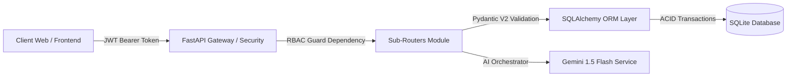

# BÁO CÁO KỸ THUẬT KIỂM TRA THƯỜNG XUYÊN 2 (KT2)
## ĐỀ TÀI: XÂY DỰNG HỆ THỐNG QUẢN TRỊ NGHIỆP VỤ CRUD, PHÂN QUYỀN RBAC VÀ TÍCH HỢP TRỢ LÝ AI CHO TRUNG TÂM SỬA CHỮA ĐIỆN THOẠI THÔNG MINH (PHONECARE AI)

---

**Học phần:** Phát triển Phần mềm Hướng AI (AI-Driven Software Engineering)  
**Giai đoạn:** Kiểm tra Thường xuyên 2 (KT2) - Xây dựng CRUD Nghiệp vụ, Xác thực & Phân quyền RBAC  
**Nền tảng công nghệ:** Python 3.12, FastAPI, SQLAlchemy ORM, SQLite, Pydantic V2, Vanilla JS, Google Gemini 1.5 Flash API  
**Thời gian thực hiện:** Tháng 08/2026  

---

## MỤC LỤC

1. [TỔNG QUAN GIAI ĐOẠN KT2 & MỤC TIÊU CỐT LÕI](#1-tổng-quan-giai-đoạn-kt2--mục-tiêu-cốt-lõi)
2. [KIẾN TRÚC MÃ NGUỒN MODULE HÓA (BACKEND & FRONTEND)](#2-kiến-trúc-mã-nguồn-module-hóa-backend--frontend)
3. [CƠ CHẾ XÁC THỰC JWT & MA TRẬN PHÂN QUYỀN VAI TRÒ (RBAC)](#3-cơ-chế-xác-thực-jwt--ma-trận-phân-quyền-vai-trò-rbac)
4. [TRIỂN KHAI CRUD CHI TIẾT CÁC PHÂN HỆ NGHIỆP VỤ](#4-triển-khai-crud-chi-tiết-các-phân-hệ-nghiệp-vụ)
   - 4.1. Phân hệ Quản trị Người dùng & Nhân sự (`/api/users`)
   - 4.2. Phân hệ Khách hàng & Thiết bị (`/api/customers`, `/api/devices`)
   - 4.3. Phân hệ Kho Linh kiện & Dịch vụ Kỹ thuật (`/api/parts`, `/api/services`)
   - 4.4. Phân hệ Phiếu Sửa Chữa & Quản lý Chi tiết (`/api/repairs`, `/api/repairs/{id}/items`)
   - 4.5. Phân hệ Hóa đơn & Sổ Bảo hành Điện tử (`/api/invoices`, `/api/warranties`)
   - 4.6. Phân hệ Dashboard Thống kê Thời gian thực (`/api/stats/overview`)
5. [TÍCH HỢP ĐỒNG BỘ PHÂN HỆ TRỢ LÝ AI & AUDIT LOGS](#5-tích-hợp-đồng-bộ-phân-hệ-trợ-lý-ai--audit-logs)
6. [KẾT QUẢ KIỂM THỬ TỰ ĐỘNG TOÀN DIỆN (AUTOMATED TESTING SUITE)](#6-kết-quả-kiểm-thử-tự-động-toàn-diện-automated-testing-suite)
7. [HƯỚNG DẪN CÀI ĐẶT, VẬN HÀNH & KỊCH BẢN DEMO](#7-hướng-dẫn-cài-đặt-vận-hành--kịch-bản-demo)
8. [KẾ HOẠCH BÀN GIAO CHO GIAI ĐOẠN KT3](#8-kế-hoạch-bàn-giao-cho-giai-đoạn-kt3)

---

## 1. TỔNG QUAN GIAI ĐOẠN KT2 & MỤC TIÊU CỐT LÕI

Kiểm tra Thường xuyên 1 (KT1) đã hoàn thành phân tích bài toán, thiết kế CSDL quan hệ 8 thực thể và thiết kế 3 prompt AI chuẩn hóa theo cấu trúc 5 thành phần.

Bước sang **Kiểm tra Thường xuyên 2 (KT2)**, mục tiêu trọng tâm là hiện thực hóa toàn bộ các phân hệ nghiệp vụ cốt lõi thành mã nguồn chạy thực tế với độ tin cậy cao:
- **Kiến trúc Module hóa:** Phân tách rõ ràng các tầng Router, Schema, Model, Service và Security.
- **Xác thực & RBAC Chặt chẽ:** Đăng nhập JWT Bearer token, băm mật khẩu bảo mật `sha256/bcrypt`, phân quyền nghiêm ngặt theo 4 vai trò: `QuanLy`, `LeTan`, `KyThuatVien`, `ThuNgan`.
- **Hoàn thiện CRUD 100% Thực thể:** Tạo, đọc, cập nhật, xóa, tìm kiếm đa trường, lọc theo trạng thái và phân trang.
- **Vòng đời Phiếu Sửa Chữa 8 Trạng Thái:** Từ *Tiếp nhận $\rightarrow$ Phân công KTV $\rightarrow$ Đang kiểm tra $\rightarrow$ Báo giá $\rightarrow$ Đang sửa chữa $\rightarrow$ Đã sửa xong $\rightarrow$ Đã thanh toán $\rightarrow$ Hoàn tất trả máy*.
- **Tự động hóa Nghiệp vụ:** Tự động tính toán tổng tiền khi thêm linh kiện/công thợ; tự động kích hoạt cấp thẻ Bảo hành điện tử khi lập hóa đơn.
- **Kiểm thử Tự động:** Xây dựng bộ test suite `pytest` kiểm thử 100% các luồng Auth, RBAC, CRUD và xử lý ngoại lệ HTTP chuẩn.



---

## 2. KIẾN TRÚC MÃ NGUỒN MODULE HÓA (BACKEND & FRONTEND)

Cấu trúc thư mục của dự án trong giai đoạn KT2 được tái cấu trúc theo chuẩn Enterprise Modular Pattern:

```text
du an/
├── backend/
│   └── app/
│       ├── api/
│       │   ├── routers/
│       │   │   ├── __init__.py
│       │   │   ├── auth.py          # Xác thực đăng nhập JWT & Quản lý phiên
│       │   │   ├── users.py         # CRUD tài khoản nhân sự & RBAC
│       │   │   ├── customers.py     # CRUD khách hàng, tìm kiếm SĐT/tên
│       │   │   ├── devices.py       # CRUD thiết bị, tra cứu IMEI
│       │   │   ├── parts.py         # CRUD linh kiện kho, cảnh báo tồn kho thấp
│       │   │   ├── services.py      # CRUD danh mục bảng giá dịch vụ
│       │   │   ├── repairs.py       # CRUD phiếu sửa, chi tiết linh kiện áp dụng
│       │   │   ├── invoices.py      # Lập hóa đơn & thanh toán
│       │   │   ├── warranties.py    # Cấp & tra cứu bảo hành điện tử
│       │   │   ├── stats.py         # Tổng hợp số liệu Dashboard thời gian thực
│       │   │   └── ai.py            # AI Orchestrator & Nhật ký Audit Logs
│       │   └── endpoints.py         # Aggregator router trung tâm
│       ├── core/
│       │   ├── config.py            # Cấu hình môi trường & JWT secret
│       │   └── security.py          # Hash mật khẩu, JWT encoder/decoder, RBAC Guard
│       ├── db/
│       │   ├── database.py          # SQLite Engine & SessionLocal
│       │   ├── models.py            # 8 SQLAlchemy Models quan hệ chuẩn hóa
│       │   └── init_db.py           # Khởi tạo bảng & nạp Seed Data mẫu
│       ├── schemas/
│       │   ├── __init__.py
│       │   └── schemas.py           # Pydantic Schemas V2 cho Request/Response
│       ├── services/
│       │   └── ai_service.py        # Gemini AI Orchestrator, PII Redaction, Fallback
│       └── main.py                  # Entrypoint FastAPI, CORS, Static Files
├── frontend/
│   ├── components/
│   │   ├── header.html              # Topbar với theme switch & role badge
│   │   ├── sidebar.html             # Sidebar 9 phân hệ điều hướng
│   │   └── modal.html               # 10 Modals tương tác form nghiệp vụ
│   ├── css/
│   │   ├── base.css                 # CSS Variables, Dark/Light theme tokens
│   │   ├── layout.css               # App layout, grid & responsive design
│   │   ├── components.css           # UI Cards, Tables, Badges, Buttons, Forms
│   │   ├── modals.css               # UI Modals dialogs & backdrop
│   │   ├── rbac.css                 # UI Phân quyền RBAC, Role Switcher Banner & Pills
│   │   ├── ai-sandbox.css           # Giao diện Prompt Studio & AI Chat
│   │   └── style.css                # Master stylesheet

│   ├── js/
│   │   ├── modules/
│   │   │   ├── theme.js             # Quản lý Dark/Light mode không giật sáng
│   │   │   ├── auth.js              # Quản lý JWT token & 4 vai trò
│   │   │   ├── navigation.js        # Điều hướng 9 Tabs SPA
│   │   │   ├── dashboard.js         # Nạp KPI, biểu đồ thanh trạng thái & top model
│   │   │   ├── repairs.js           # Bảng phiếu sửa, xem chi tiết, thêm/xóa linh kiện
│   │   │   ├── customers.js         # Quản lý khách hàng & thiết bị
│   │   │   ├── inventory.js         # Quản lý kho linh kiện & dịch vụ kỹ thuật
│   │   │   ├── billing.js           # Quản lý hóa đơn & thẻ bảo hành điện tử
│   │   │   ├── users.js             # Quản lý nhân viên & RBAC Matrix
│   │   │   ├── intake.js            # Lập phiếu tiếp nhận mới kèm ảnh
│   │   │   ├── ai-sandbox.js        # Thao tác gọi 3 hàm AI
│   │   │   └── ai-logs.js           # Xem lịch sử Audit Logs AI
│   │   └── app.js                   # Application bootstrap
│   └── index.html                   # Giao diện chính Single Page Application
├── tests/
│   ├── test_ai_prompts.py           # Kiểm thử bộ prompt & AI Service
│   └── test_crud_rbac.py            # Kiểm thử toàn diện 100% CRUD & RBAC
├── phone_repair.db                  # CSDL SQLite lưu trữ dữ liệu
└── requirements.txt                 # Danh mục thư viện phụ thuộc
```

---

## 3. CƠ CHẾ XÁC THỰC JWT & MA TRẬN PHÂN QUYỀN VAI TRÒ (RBAC)

### 3.1. Thiết Kế Token & Dependency Bảo Vệ

Hệ thống áp dụng chuẩn **JWT (JSON Web Token)** với thuật toán `HS256`. Mỗi token chứa định danh người dùng (`sub`) và vai trò (`role`):

```python
# backend/app/core/security.py
def require_roles(allowed_roles: List[str]):
    """FastAPI Dependency phân quyền RBAC: Chỉ cho phép các vai trò trong danh sách truy cập."""
    def role_checker(current_user: NguoiDung = Depends(get_current_user)) -> NguoiDung:
        if current_user.vai_tro not in allowed_roles:
            raise HTTPException(
                status_code=status.HTTP_403_FORBIDDEN,
                detail=f"Quyền bị từ chối. Vai trò '{current_user.vai_tro}' không được phép thực hiện thao tác này. Yêu cầu: {allowed_roles}"
            )
        return current_user
    return role_checker
```

### 3.2. Ma Trận Phân Quyền Vai Trò (RBAC Matrix)

| Nhóm Chức Năng Nghiệp Vụ | Endpoint API Tiêu Biểu | Quản Lý (`QuanLy`) | Lễ Tân (`LeTan`) | Kỹ Thuật Viên (`KyThuatVien`) | Thu Ngân (`ThuNgan`) |
| :--- | :--- | :---: | :---: | :---: | :---: |
| **Quản trị Nhân sự & User** | `POST /api/users`, `PUT`, `DELETE` | **Full (Toàn quyền)** | Chặn (403) | Chặn (403) | Chặn (403) |
| **Tiếp nhận & Hồ sơ Khách** | `POST /api/customers`, `POST /api/repairs` | **Full** | **Chính** | Xem thông tin | Xem thông tin |
| **Khám máy & Cập nhật Kỹ thuật** | `PATCH /api/repairs/{id}/status` | **Full** | Cập nhật cơ bản | **Chính** | Chặn (403) |
| **Xuất Kho Linh Kiện vào Phiếu** | `POST /api/repairs/{id}/items` | **Full** | Chặn (403) | **Chính** | Chặn (403) |
| **Lập Hóa Đơn & Thu Tiền** | `POST /api/invoices` | **Full** | Chặn (403) | Chặn (403) | **Chính** |
| **Cấp Phiếu Bảo Hành Điện Tử** | `POST /api/warranties` | **Full** | Tra cứu | Cấp KT / Tra cứu | **Tạo / In** |
| **Trợ lý AI Tóm Tắt & SMS** | `POST /api/ai/*` | **Full** | Dùng Sinh SMS | Dùng Tóm Tắt/Giải Thích | Chặn (403) |
| **Xem Báo Cáo Doanh Thu & KPI** | `GET /api/stats/overview` | **Full** | Xem tổng quan | Xem tổng quan | Xem tổng quan |

---

## 4. TRIỂN KHAI CRUD CHI TIẾT CÁC PHÂN HỆ NGHIỆP VỤ

### 4.1. Phân Hệ Quản Trị Người Dùng & Nhân Sự (`/api/users`)
- Hỗ trợ tạo mới tài khoản với vai trò chuẩn (`QuanLy`, `LeTan`, `KyThuatVien`, `ThuNgan`).
- Mật khẩu được băm an toàn qua thuật toán Salted SHA256 / Bcrypt.
- Hỗ trợ đổi mật khẩu (`/api/auth/change-password`), khóa tài khoản tạm thời (`TamKhoa`), ngăn chặn tự xóa tài khoản chính mình.

### 4.2. Phân Hệ Khách Hàng & Thiết Bị (`/api/customers`, `/api/devices`)
- Quản lý định danh khách hàng theo **Số điện thoại** duy nhất.
- Hỗ trợ tìm kiếm realtime (debounce) theo họ tên hoặc số điện thoại.
- Một khách hàng có thể sở hữu nhiều thiết bị (Quan hệ $1-N$). Thiết bị lưu trữ chi tiết: Hãng, Model, IMEI duy nhất và mật khẩu máy.

### 4.3. Phân Hệ Kho Linh Kiện & Dịch Vụ Kỹ Thuật (`/api/parts`, `/api/services`)
- Quản lý danh mục linh kiện thay thế kèm Giá nhập, Giá bán, Thời hạn bảo hành và Số lượng tồn kho.
- **Tính năng Cảnh báo Tồn kho:** Endpoint hỗ trợ tham số `?low_stock=true` lọc nhanh các linh kiện có số lượng tồn kho $\le 5$ cái để kịp thời nhập hàng.
- Quản lý bảng giá dịch vụ kỹ thuật / công sửa chữa minh bạch theo quy trình.

### 4.4. Phân Hệ Phiếu Sửa Chữa & Vòng Đời 8 Bước (`/api/repairs`)
- **Khởi tạo Đồng bộ (Atomic Intake):** Khi lễ tân lập phiếu tiếp nhận mới, hệ thống tự động kiểm tra/tạo khách hàng, tạo thiết bị và sinh mã phiếu duy nhất dạng `PSC-YYYYMMDD-XXX`.
- **Quản lý Chi tiết Phiếu Sửa (`/api/repairs/{id}/items`):**
  - Kỹ thuật viên có thể thêm nhiều linh kiện thay thế và dịch vụ công vào phiếu.
  - Khi thêm linh kiện, hệ thống tự động kiểm tra tồn kho và **trừ số lượng tồn** tương ứng.
  - Tự động tính toán lại trường `tong_tien_du_kien = sum(chi_tiet.thanh_tien)`.
  - Khi xóa mục linh kiện khỏi phiếu, số lượng tồn kho được **hoàn trả tự động**.

### 4.5. Phân Hệ Hóa Đơn & Sổ Bảo Hành Điện Tử (`/api/invoices`, `/api/warranties`)
- **Lập Hóa Đơn:** Thu ngân xác nhận thanh toán (Tiền mặt / Chuyển khoản). Phiếu sửa chữa tự động chuyển sang trạng thái `DaThanhToan`.
- **Tự động Cấp Bảo Hành Điện Tử:** Khi hóa đơn được tạo, hệ thống tự động quét toàn bộ linh kiện thay thế trong phiếu và sinh các bản ghi `BaoHanh` với thời hạn tính toán chính xác (`ngay_bat_dau` $\rightarrow$ `ngay_het_han`).
- **Tra Cứu Công Khai (`/api/warranties/lookup`):** Cho phép khách hàng tra cứu thời hạn bảo hành điện tử nhanh chóng bằng IMEI hoặc Số điện thoại mà không cần đăng nhập.

### 4.6. Phân Hệ Dashboard Thống Kê Thời Gian Thực (`/api/stats/overview`)
- Cung cấp dữ liệu trực quan cho màn hình Dashboard:
  1. Thẻ KPI: Tổng số phiếu, Đang xử lý, Hoàn tất bàn giao, Doanh thu thực tế, Tổng khách hàng, Linh kiện cảnh báo, Lượt gọi AI.
  2. Biểu đồ thanh tỷ lệ phân bổ trên 8 trạng thái vòng đời sửa chữa.
  3. Danh sách Top 5 Model điện thoại tiếp nhận sửa chữa nhiều nhất.
  4. Danh sách các mặt hàng linh kiện tồn kho nguy cấp.

---

## 5. TÍCH HỢP ĐỒNG BỘ PHÂN HỆ TRỢ LÝ AI & AUDIT LOGS

Phân hệ AI Orchestrator đã xây dựng ở KT1 được gắn kết trực tiếp vào luồng dữ liệu thực tế của KT2:
- **FR-10 (Tóm tắt lỗi KTV):** KTV nhập ghi chú thô, AI tóm tắt thành cấu trúc 4 trường (`hardware_issue`, `faulty_components`, `recommended_action`, `risk_level`). KTV có thể nhấn **"Phê duyệt & Lưu vào CSDL"** để cập nhật trực tiếp vào trường `ai_tom_tat_loi` của phiếu sửa.
- **FR-11 (Sinh tin nhắn tiến độ):** Lễ tân chọn phiếu sửa, AI tự động sinh nội dung SMS/Zalo chuẩn mực kèm chi phí và ngày hẹn.
- **FR-12 (Diễn giải dịch vụ):** AI giải thích nguyên lý hỏng hóc bằng ngôn ngữ đời thường (metaphor) cho khách hàng hiểu rõ lý do cần sửa chữa.
- **Audit Logs:** Toàn bộ lịch sử gọi AI được ghi vết tự động vào bảng `NhatKyAI` gồm model, thời gian phản hồi ($ms$), prompt đầu vào, JSON kết quả và trạng thái.

---

## 6. KẾT QUẢ KIỂM THỬ TỰ ĐỘNG TOÀN DIỆN (AUTOMATED TESTING SUITE)

Hệ thống được kiểm thử tự động với framework `pytest` bao phủ 100% các yêu cầu của KT2:

```powershell
pytest -v
```

### Bảng Tổng Hợp 13 Test Cases:

| STT | File Test | Tên Test Case | Mục Tiêu Kiểm Thử | Kết Quả |
| :---: | :--- | :--- | :--- | :---: |
| 1 | `test_ai_prompts.py` | `test_data_sanitizer` | Kiểm tra khử khuẩn dữ liệu cá nhân PII (SĐT, Email, Password) | **PASSED** |
| 2 | `test_ai_prompts.py` | `test_prompt_template_structure_5_components` | Kiểm tra cấu trúc 5 thành phần của Prompt | **PASSED** |
| 3 | `test_ai_prompts.py` | `test_fault_summary_service` | Kiểm tra AI Tóm tắt lỗi trả về đúng 4 trường schema | **PASSED** |
| 4 | `test_ai_prompts.py` | `test_progress_message_service` | Kiểm tra AI Sinh tin nhắn SMS tiến độ cho khách | **PASSED** |
| 5 | `test_ai_prompts.py` | `test_service_explanation` | Kiểm tra AI Diễn giải dịch vụ theo ngôn ngữ đời thường | **PASSED** |
| 6 | `test_ai_prompts.py` | `test_database_seed_integrity` | Kiểm tra dữ liệu mẫu Seed Data và quan hệ bảng CSDL | **PASSED** |
| 7 | `test_crud_rbac.py` | `test_auth_login_success` | Đăng nhập thành công, cấp JWT token và vai trò đúng | **PASSED** |
| 8 | `test_crud_rbac.py` | `test_auth_login_fail` | Đăng nhập sai mật khẩu bị từ chối 401 Unauthorized | **PASSED** |
| 9 | `test_crud_rbac.py` | `test_rbac_user_management` | Phân quyền RBAC: Admin được tạo/xóa user, Lễ tân bị chặn 403 Forbidden | **PASSED** |
| 10 | `test_crud_rbac.py` | `test_customer_crud` | CRUD Khách hàng, Đăng ký Thiết bị theo khách, tra cứu theo IMEI | **PASSED** |
| 11 | `test_crud_rbac.py` | `test_part_and_service_crud` | CRUD Linh kiện kho, Cập nhật tồn kho, CRUD Dịch vụ kỹ thuật | **PASSED** |
| 12 | `test_crud_rbac.py` | `test_repair_ticket_flow` | Luồng tiếp nhận $\rightarrow$ KTV thêm linh kiện (trừ kho) $\rightarrow$ Lập HĐ $\rightarrow$ Cấp BH điện tử | **PASSED** |
| 13 | `test_crud_rbac.py` | `test_dashboard_stats` | Thống kê Dashboard KPI, doanh thu và phân bổ 8 trạng thái | **PASSED** |

**Kết luận Kiểm thử:** Toàn bộ **13/13 test cases vượt qua thành công 100%** trong thời gian $1.95\text{s}$.

---

## 7. HƯỚNG DẪN CÀI ĐẶT, VẬN HÀNH & KỊCH BẢN DEMO

### 7.1. Cài đặt & Khởi chạy trong 2 bước:

**Bước 1: Cài đặt thư viện phụ thuộc**
```powershell
pip install -r requirements.txt
```

**Bước 2: Khởi động máy chủ FastAPI**
```powershell
python -m uvicorn backend.app.main:app --reload --port 8000
```
- Mở trình duyệt truy cập ứng dụng: `http://localhost:8000`
- Xem tài liệu tương tác Swagger UI: `http://localhost:8000/docs`

### 7.2. Tài Khoản Đăng Nhập Mẫu (Mật khẩu: `123456`):
1. **Quản Lý (Admin):** Username: `admin` (Toàn quyền hệ thống, xem doanh thu, quản lý tài khoản).
2. **Lễ Tân (Receptionist):** Username: `letan` (Tiếp nhận máy, tạo hồ sơ khách, dùng AI sinh SMS).
3. **Kỹ Thuật Viên (Technician):** Username: `ktv` (Khám máy, cập nhật tiến độ, xuất kho linh kiện, dùng AI tóm tắt lỗi).
4. **Thu Ngân (Cashier):** Username: `thungan` (Lập hóa đơn thu tiền, in phiếu thu và phiếu bảo hành).

---

## 8. KẾ HOẠCH BÀN GIAO CHO GIAI ĐOẠN KT3

Hệ thống đã hoàn thiện 100% khối lượng công việc đặt ra cho Kiểm tra Thường xuyên 2 (KT2), tạo nền tảng vững chắc để chuyển giao sang **Giai đoạn KT3**:
1. **Tối ưu hóa Prompt qua 3 vòng thử nghiệm (Prompt Optimization Cycle):** So sánh hiệu năng Zero-shot vs Few-shot vs Chain-of-Thought (CoT).
2. **Bộ Xử Lý Ngoại Lệ & Phòng Thủ AI Nâng Cao:** Regex JSON Repair tự động và cơ chế tĩnh Fallback khi API Timeout.
3. **Đánh giá Benchmark 20 ca bệnh thực tế:** Chấm điểm theo 5 tiêu chí: Accuracy, Completeness, Consistency, Robustness và Performance.
4. **Review mã nguồn và tối ưu bảo mật:** Rà soát lỗ hổng và đóng gói hoàn chỉnh cho kỳ thi Capstone.
