# 2. THIẾT KẾ TÁC NHÂN (ACTORS) VÀ CA SỬ DỤNG (USE CASE)

## 2.1. Phân tích Tác nhân (Actors)
1. **Quản lý (Manager/Admin)**:
   - Toàn quyền quản trị hệ thống: Thêm/sửa/khóa tài khoản nhân sự, phân quyền vai trò.
   - Quản lý danh mục linh kiện, bảng giá dịch vụ và chính sách bảo hành.
   - Khai thác báo cáo thống kê doanh thu, tỷ lệ lỗi và đánh giá hiệu suất làm việc của KTV.
2. **Lễ tân (Receptionist)**:
   - Tiếp đón khách hàng, tra cứu/thêm mới hồ sơ khách hàng và thiết bị.
   - Khởi tạo phiếu tiếp nhận máy ban đầu, in biên nhận bàn giao có mã QR tra cứu.
   - Phân công phiếu sửa chữa cho KTV phù hợp.
   - Kích hoạt trợ lý AI sinh tin nhắn tiến độ và gửi thông báo qua SMS/Zalo cho khách.
3. **Kỹ thuật viên (Technician)**:
   - Tiếp nhận danh sách thiết bị được phân công trong hàng đợi cá nhân.
   - Kiểm tra, đo đạc phần cứng, nhập ghi chú kỹ thuật chi tiết.
   - Kích hoạt trợ lý AI tóm tắt lỗi kỹ thuật chuẩn hóa, kiểm tra và phê duyệt bản nháp (HITL).
   - Đề xuất linh kiện thay thế từ kho và chuyển đổi trạng thái vòng đời sửa chữa.
4. **Thu ngân (Cashier)**:
   - Tiếp nhận phiếu sửa chữa đã hoàn tất (`DaSuaXong`).
   - Tổng hợp chi phí, lập hóa đơn, thực hiện thu tiền và in biên lai giao khách.
   - Tự động kích hoạt mã bảo hành điện tử và bàn giao máy.
5. **Khách hàng (Customer)**:
   - Tra cứu trực tuyến tiến độ sửa chữa thiết bị bằng mã phiếu hoặc quét QR Code.
   - Đọc bản tóm tắt tình trạng và giải thích dịch vụ do AI tạo bằng ngôn ngữ dễ hiểu.

## 2.2. Sơ đồ Use Case Tổng Quát

```mermaid
graph TD
    subgraph "HỆ THỐNG QUẢN LÝ TRUNG TÂM SỬA CHỮA ĐIỆN THOẠI"
        UC_Login["Đăng nhập hệ thống (FR-01)"]
        
        %% Quản lý
        UC_QL_User["Quản lý Tài khoản & Phân quyền"]
        UC_QL_Price["Quản lý Bảng giá & Linh kiện (FR-06)"]
        UC_QL_Report["Xem Báo cáo Thống kê (FR-09)"]
        
        %% Lễ tân
        UC_LT_Cust["Quản lý Khách hàng & Thiết bị (FR-02)"]
        UC_LT_Receive["Tiếp nhận máy & Lập phiếu (FR-03)"]
        UC_LT_Assign["Phân công Kỹ thuật viên (FR-04)"]
        UC_LT_Notify["Gửi tin nhắn tiến độ (FR-11)"]
        
        %% Kỹ thuật viên
        UC_KTV_Diagnose["Chẩn đoán & Cập nhật trạng thái (FR-05)"]
        UC_KTV_PartReq["Đề xuất linh kiện & Dịch vụ"]
        
        %% Thu ngân
        UC_TN_Invoice["Lập hóa đơn thanh toán (FR-07)"]
        UC_TN_Warranty["Quản lý Bảo hành sau sửa (FR-08)"]
        
        %% Khách hàng
        UC_KH_Track["Tra cứu tiến độ & Đọc giải thích (FR-12)"]
        
        %% PHÂN HỆ AI
        subgraph "PHÂN HỆ TRỢ LÝ AI THÔNG MINH"
            UC_AI_Summary["AI Tóm tắt tình trạng máy (FR-10)"]
            UC_AI_Msg["AI Sinh tin nhắn tiến độ (FR-11)"]
            UC_AI_Explain["AI Diễn giải lỗi & Dịch vụ (FR-12)"]
        end
    end

    Actor_Admin(("Quản lý"))
    Actor_Rec(("Lễ tân"))
    Actor_Tech(("Kỹ thuật viên"))
    Actor_Cash(("Thu ngân"))
    Actor_Cust(("Khách hàng"))

    Actor_Admin --> UC_Login
    Actor_Admin --> UC_QL_User
    Actor_Admin --> UC_QL_Price
    Actor_Admin --> UC_QL_Report

    Actor_Rec --> UC_Login
    Actor_Rec --> UC_LT_Cust
    Actor_Rec --> UC_LT_Receive
    Actor_Rec --> UC_LT_Assign
    Actor_Rec --> UC_LT_Notify

    Actor_Tech --> UC_Login
    Actor_Tech --> UC_KTV_Diagnose
    Actor_Tech --> UC_KTV_PartReq

    Actor_Cash --> UC_Login
    Actor_Cash --> UC_TN_Invoice
    Actor_Cash --> UC_TN_Warranty

    Actor_Cust --> UC_KH_Track

    %% Extend relationships
    UC_KTV_Diagnose -.->|<<extend>>| UC_AI_Summary
    UC_LT_Notify -.->|<<extend>>| UC_AI_Msg
    UC_KH_Track -.->|<<extend>>| UC_AI_Explain
    UC_LT_Receive -.->|<<extend>>| UC_AI_Explain
```

## 2.3. Ma trận Phân quyền Vai trò (RBAC Matrix)

| Module / Chức Năng | Quản Lý (Admin) | Lễ Tân (Reception) | Kỹ Thuật Viên (Technician) | Thu Ngân (Cashier) | Khách Hàng (Customer) |
|---|:---:|:---:|:---:|:---:|:---:|
| Quản lý tài khoản & phân quyền | Full (CRUD) | None | None | None | None |
| Quản lý danh mục linh kiện & giá | Full (CRUD) | View | View | View | None |
| Tiếp nhận máy & Tạo phiếu sửa | Full (CRUD) | Full (CRUD) | View | View | None |
| Phân công KTV sửa chữa | Full | Update | None | None | None |
| Chẩn đoán kỹ thuật & Cập nhật trạng thái | View | View | Full (Update) | View | None |
| Kích hoạt AI Tóm tắt lỗi (FR-10) | View | View | Execute & Approve | None | None |
| Kích hoạt AI Sinh tin nhắn (FR-11) | View | Execute & Send | None | None | None |
| Xem AI Giải thích dịch vụ (FR-12) | View | View | View | View | View (Public) |
| Lập hóa đơn & Thu tiền (FR-07) | Full | View | None | Full (CRUD) | None |
| Quản lý bảo hành điện tử (FR-08) | Full | View | View | Full (CRUD) | View (Tra cứu) |
| Báo cáo thống kê doanh thu & lỗi | Full | None | None | Báo cáo ca | None |
| Tra cứu tiến độ trực tuyến | View | View | View | View | View (Read-only) |
