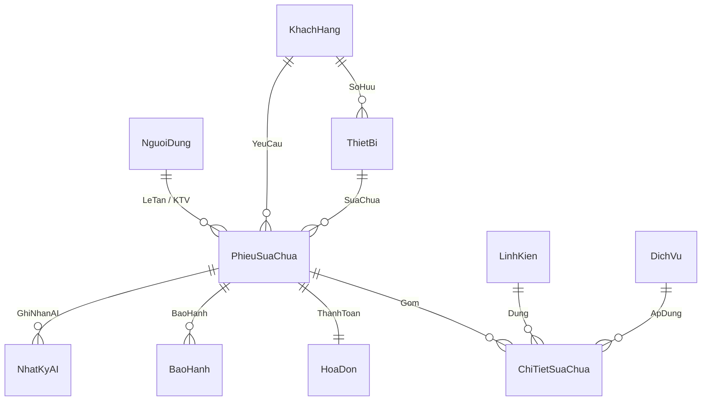

# 3. THIẾT KẾ CƠ SỞ DỮ LIỆU (DATABASE DESIGN)

## 3.1. Sơ đồ Quan hệ Thực thể (ERD)



## 3.2. Đặc tả Chi tiết các Bảng CSDL (SQLite DDL Schema)

```sql
-- 1. Bảng Người dùng (Nhân viên & Quản lý)
CREATE TABLE IF NOT EXISTS nguoi_dung (
    id INTEGER PRIMARY KEY AUTOINCREMENT,
    ten_dang_nhap VARCHAR(50) NOT NULL UNIQUE,
    mat_khau_hash VARCHAR(255) NOT NULL,
    ho_ten VARCHAR(100) NOT NULL,
    vai_tro VARCHAR(30) NOT NULL CHECK (vai_tro IN ('QuanLy', 'LeTan', 'KyThuatVien', 'ThuNgan')),
    so_dien_thoai VARCHAR(15),
    trang_thai VARCHAR(20) DEFAULT 'HoatDong' CHECK (trang_thai IN ('HoatDong', 'Khoa')),
    ngay_tao DATETIME DEFAULT CURRENT_TIMESTAMP
);

-- 2. Bảng Khách hàng
CREATE TABLE IF NOT EXISTS khach_hang (
    id INTEGER PRIMARY KEY AUTOINCREMENT,
    ho_ten VARCHAR(100) NOT NULL,
    so_dien_thoai VARCHAR(15) NOT NULL UNIQUE,
    dia_chi VARCHAR(255),
    ngay_tao DATETIME DEFAULT CURRENT_TIMESTAMP
);

-- 3. Bảng Thiết bị
CREATE TABLE IF NOT EXISTS thiet_bi (
    id INTEGER PRIMARY KEY AUTOINCREMENT,
    khach_hang_id INTEGER NOT NULL,
    hang_san_xuat VARCHAR(50) NOT NULL,
    model_may VARCHAR(100) NOT NULL,
    so_imei VARCHAR(30) NOT NULL UNIQUE,
    mat_khau_may VARCHAR(50),
    ngay_tao DATETIME DEFAULT CURRENT_TIMESTAMP,
    FOREIGN KEY (khach_hang_id) REFERENCES khach_hang(id) ON DELETE CASCADE
);

-- 4. Bảng Linh kiện trong kho
CREATE TABLE IF NOT EXISTS linh_kien (
    id INTEGER PRIMARY KEY AUTOINCREMENT,
    ma_linh_kien VARCHAR(50) NOT NULL UNIQUE,
    ten_linh_kien VARCHAR(150) NOT NULL,
    loai_may VARCHAR(100),
    gia_nhap DECIMAL(12,2) NOT NULL,
    gia_ban DECIMAL(12,2) NOT NULL,
    so_luong_ton INTEGER NOT NULL CHECK (so_luong_ton >= 0),
    thoi_han_bao_hanh_thang INTEGER DEFAULT 6,
    ngay_cap_nhat DATETIME DEFAULT CURRENT_TIMESTAMP
);

-- 5. Bảng Dịch vụ sửa chữa / Tiền công
CREATE TABLE IF NOT EXISTS dich_vu (
    id INTEGER PRIMARY KEY AUTOINCREMENT,
    ma_dich_vu VARCHAR(50) NOT NULL UNIQUE,
    ten_dich_vu VARCHAR(150) NOT NULL,
    gia_cong DECIMAL(12,2) NOT NULL,
    mo_ta TEXT
);

-- 6. Bảng Phiếu sửa chữa (Thực thể cốt lõi)
CREATE TABLE IF NOT EXISTS phieu_sua_chua (
    id INTEGER PRIMARY KEY AUTOINCREMENT,
    ma_phieu VARCHAR(30) NOT NULL UNIQUE,
    khach_hang_id INTEGER NOT NULL,
    thiet_bi_id INTEGER NOT NULL,
    le_tan_id INTEGER NOT NULL,
    ktv_id INTEGER,
    mo_ta_loi_khach TEXT NOT NULL,
    ghi_chu_ky_thuat TEXT,
    ai_tom_tat_loi TEXT,
    ai_giai_thich_dv TEXT,
    trang_thai VARCHAR(30) NOT NULL DEFAULT 'TiepNhan' CHECK (
        trang_thai IN ('TiepNhan', 'PhanCongKTV', 'DangKiemTra', 'BaoGia_ChoDuyet', 'DangSuaChua', 'DaSuaXong', 'DaThanhToan', 'HoanTat_TraMay', 'HuySuaChua')
    ),
    tong_tien_du_kien DECIMAL(12,2) DEFAULT 0,
    ngay_tiep_nhan DATETIME DEFAULT CURRENT_TIMESTAMP,
    ngay_hen_tra DATETIME,
    ngay_hoan_tat DATETIME,
    FOREIGN KEY (khach_hang_id) REFERENCES khach_hang(id),
    FOREIGN KEY (thiet_bi_id) REFERENCES thiet_bi(id),
    FOREIGN KEY (le_tan_id) REFERENCES nguoi_dung(id),
    FOREIGN KEY (ktv_id) REFERENCES nguoi_dung(id)
);

-- 7. Bảng Chi tiết sửa chữa (Linh kiện & Dịch vụ của phiếu)
CREATE TABLE IF NOT EXISTS chi_tiet_sua_chua (
    id INTEGER PRIMARY KEY AUTOINCREMENT,
    phieu_sua_chua_id INTEGER NOT NULL,
    linh_kien_id INTEGER,
    dich_vu_id INTEGER,
    so_luong INTEGER DEFAULT 1 CHECK (so_luong > 0),
    don_gia DECIMAL(12,2) NOT NULL,
    thanh_tien DECIMAL(12,2) NOT NULL,
    FOREIGN KEY (phieu_sua_chua_id) REFERENCES phieu_sua_chua(id) ON DELETE CASCADE,
    FOREIGN KEY (linh_kien_id) REFERENCES linh_kien(id),
    FOREIGN KEY (dich_vu_id) REFERENCES dich_vu(id)
);

-- 8. Bảng Hóa đơn thanh toán
CREATE TABLE IF NOT EXISTS hoa_don (
    id INTEGER PRIMARY KEY AUTOINCREMENT,
    ma_hoa_don VARCHAR(30) NOT NULL UNIQUE,
    phieu_sua_chua_id INTEGER NOT NULL UNIQUE,
    thu_ngan_id INTEGER NOT NULL,
    tong_tien DECIMAL(12,2) NOT NULL,
    phuong_thuc_tt VARCHAR(30) NOT NULL CHECK (phuong_thuc_tt IN ('TienMat', 'ChuyenKhoan')),
    trang_thai_tt VARCHAR(30) DEFAULT 'DaThanhToan',
    ngay_thanh_toan DATETIME DEFAULT CURRENT_TIMESTAMP,
    FOREIGN KEY (phieu_sua_chua_id) REFERENCES phieu_sua_chua(id),
    FOREIGN KEY (thu_ngan_id) REFERENCES nguoi_dung(id)
);

-- 9. Bảng Bảo hành điện tử
CREATE TABLE IF NOT EXISTS bao_hanh (
    id INTEGER PRIMARY KEY AUTOINCREMENT,
    ma_bao_hanh VARCHAR(30) NOT NULL UNIQUE,
    phieu_sua_chua_id INTEGER NOT NULL,
    linh_kien_id INTEGER NOT NULL,
    ngay_bat_dau DATETIME DEFAULT CURRENT_TIMESTAMP,
    ngay_het_han DATETIME NOT NULL,
    dieu_kien_bh TEXT,
    trang_thai VARCHAR(20) DEFAULT 'ConHan' CHECK (trang_thai IN ('ConHan', 'HetHan', 'TuChoi')),
    FOREIGN KEY (phieu_sua_chua_id) REFERENCES phieu_sua_chua(id),
    FOREIGN KEY (linh_kien_id) REFERENCES linh_kien(id)
);

-- 10. Bảng Nhật ký AI (AI Audit Log & Analytics)
CREATE TABLE IF NOT EXISTS nhat_ky_ai (
    id INTEGER PRIMARY KEY AUTOINCREMENT,
    phieu_sua_chua_id INTEGER,
    loai_tac_vu VARCHAR(50) NOT NULL CHECK (loai_tac_vu IN ('TomTatLoi', 'SinhTinNhan', 'GiaiThichDichVu')),
    model_name VARCHAR(50) DEFAULT 'gemini-1.5-flash',
    prompt_input TEXT NOT NULL,
    ai_raw_response TEXT,
    ai_parsed_json TEXT,
    execution_time_ms FLOAT,
    trang_thai VARCHAR(30) CHECK (trang_thai IN ('ThanhCong', 'Fallback', 'Loi')),
    ngay_thuc_hien DATETIME DEFAULT CURRENT_TIMESTAMP,
    FOREIGN KEY (phieu_sua_chua_id) REFERENCES phieu_sua_chua(id) ON DELETE SET NULL
);
```

## 3.3. Các Ràng Buộc Toàn Vẹn và Khóa
- Khóa chính tự tăng `id` cho toàn bộ các bảng đảm bảo tính độc lập.
- Khóa duy nhất (Unique Constraints) cho: `so_dien_thoai` (Khách hàng), `so_imei` (Thiết bị), `ma_phieu` (Phiếu sửa chữa), `ma_linh_kien`, `ma_hoa_don`, `ma_bao_hanh`.
- Khóa ngoại liên kết logic đảm bảo toàn vẹn tham chiếu, kích hoạt `ON DELETE CASCADE` ở các bảng chi tiết để tránh dữ liệu mồ côi.
